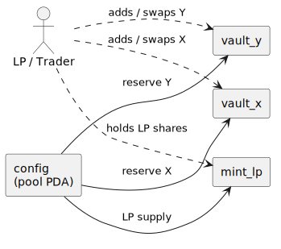
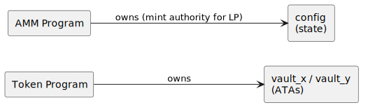
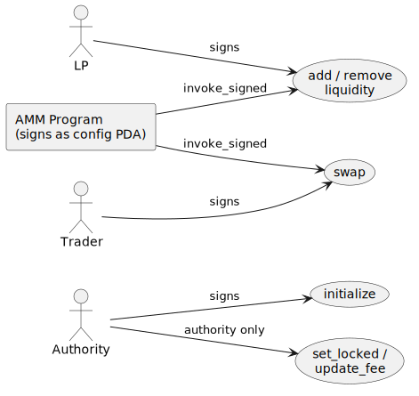
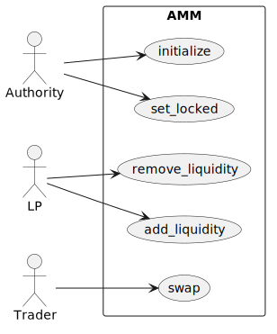

# CPAMM: A Constant-Product AMM

This is the finale, and it pulls together every thread in the book: the [bundle derive](../instructions/bundled-pubkeys.md) at full stretch, the [actors model](../running/accounts-as-actors.md) scaling to a cast that no longer fits on a sticky note, an *invariant* to assert (not just a balance), and [rendered output](../inspect/cpi-tree.md) with real CPI depth.

We'll build against a standard constant-product AMM (a Uniswap-v2-style `x·y=k` pool): two token mints, a pool that custodies reserves in two vaults, an LP mint that represents a share of the pool, and the operations that move value around it (initialize, add and remove liquidity, swap, plus a few admin paths).

Two things make this chapter different from Vault and Escrow. First, the field names below are *real*: they're the account sets from a working AMM (the capstone AMM dogfood port at `programs/amm`), so the names you read here (`mint_x`, `vault_y`, `user_x`, and friends) are the names that program's `#[derive(Accounts)]` structs actually carry. Second, the AMM is where the bundle derive's second projection mode, [`BundleFrom`](../instructions/bundled-pubkeys.md), does real work: a swap's bundle is assembled from *two* fixtures (a pool and a user) in one call.

## How we model it

A constant-product pool custodies reserves of two tokens (`mint_x`, `mint_y`) in two vaults, and mints an LP token (`mint_lp`) that represents a share of those reserves. Liquidity providers deposit both tokens and receive LP shares; traders swap one token for the other, paying a fee; the product of the two reserves, `k = reserve_x · reserve_y`, may only grow. A `config` PDA holds the pool state and is the mint authority for the LP token.

## The cast of characters

Vault had three actors and Escrow six; a pool has more, and this is where the actors model shows it doesn't fall apart as the cast grows, because every account is named.

| Actor | Kind | Role |
| --- | --- | --- |
| **authority** | user (signer) | creates the pool; can lock it and change the fee |
| **LP** (alice) | user (signer) | adds and removes liquidity |
| **trader** (bob) | user (signer) | swaps one token for the other |
| **mint_x / mint_y** | mints | the trading pair (`mint_x < mint_y` by pubkey) |
| **mint_lp** | mint | the LP share token (its mint authority is `config`) |
| **config** | PDA (program account) | the pool's state |
| **vault_x / vault_y** | PDAs (token accounts) | the reserves |



## Ownership

The reserves and the LP mint are owned by the **Token program**; the AMM program owns only the `config` state account and signs as the `config` PDA to move the vaults and mint LP shares.



## Authority

Each instruction has its signer: the authority for `initialize` and the admin paths, an LP for liquidity, a trader for `swap`. The admin paths (`set_locked`, `update_fee`) additionally check the signer against `config.authority`.



## The use cases



## The bundle, defined once in the program

Two derives do the work, and they sit in different places.

The first is on a host-only **bundle struct** in the program's `src/`. It lists the pubkeys a family of instructions varies over, and it carries *two* derives: `Bundle` (which gives it a `Default` that fills every field with a throwaway `Pubkey::new_unique()`) and `BundleFrom` (which projects the bundle out of source fixtures). The `#[from_fixtures(...)]` attribute names those fixtures and binds them to short names; here `p` for the pool and `u` for the user:

```rust
{{#include ../../listings/cpamm/programs/amm/src/instructions/swap.rs:swapbundle}}
```

A bare field (no `#[from(...)]`) projects from the first declared fixture by name, so `mint_x` becomes `p.mint_x`. The `#[from(...)]` overrides handle the user-side fields and renames (`user_x` from `u.ata_x`).

The projection rule is worth stating precisely, because it's the one thing that bites: a bare field (no `#[from(...)]`) projects from the **first** declared fixture, by field name. So `mint_x: Pubkey` with no annotation becomes `p.mint_x`. Put your primary fixture first (the pool, here, since it owns most of the accounts) and reach for `#[from(...)]` only when the source is the other fixture or the names disagree. The macro can't read the fixture structs at expansion time (proc-macros only see their own input), so if a bare field doesn't actually exist on the first fixture, you get a rustc field-not-found error pointed at the field by name; that's your signal to add an override.

The second derive is the [`BundledPubkeys`](../instructions/bundled-pubkeys.md) one you've seen since the [first test](../intro/first-test.md), on the instruction's `#[derive(Accounts)]` struct. It's what pairs `SwapBundle` with the account list *and* the args, so `build` knows which bundle goes with which instruction:

```rust
{{#include ../../listings/cpamm/programs/amm/src/instructions/swap.rs:swapaccounts}}
```

Notice what's absent from `SwapBundle`: `token_program`. The accounts struct declares it as `Interface<TokenInterface>`, and `BundledPubkeys` recognizes that type and [auto-injects](../instructions/bundled-pubkeys.md) the canonical SPL Token id. So the bundle carries only what a test varies. The host-only machinery is gated `#[cfg(not(target_os = "solana"))]`, the same as every other listing, so none of it ships in the BPF build.

## The fixtures the bundle projects from

`BundleFrom` is only useful if there's something to project *from*. The AMM defines two fixtures (both in `programs/amm/src/test_helpers.rs`), and they map onto the two halves of the cast: shared pool state, and per-actor accounts.

```rust
{{#include ../../listings/cpamm/programs/amm/src/test_helpers.rs:poolfixture}}
```

```rust
{{#include ../../listings/cpamm/programs/amm/src/test_helpers.rs:userfixture}}
```

Two things to notice. First, `Pool` carries `#[derive(AliasMirror)]`, the fourth member of the [bundle family](../instructions/bundled-pubkeys.md): it generates an `alias_all(&self, ctx)` that registers every labelled field in the alias table in one call, so the pool's accounts name themselves in your rendered output. (`mint_x` / `mint_y` are `#[alias(skip)]` because the harness aliases the global mints once at setup; re-aliasing them per pool would be redundant.) Second, `UserAccounts` is *the* actor type for the whole suite: one struct covers LPs, traders, admins, and attackers, with the narrative role carried by the variable name and the `label`, not by the type.

With those in hand, building a bundle is one call: `SwapBundle::from((&pool, &user))`. A swap touches ten accounts, but the test never spells ten pubkeys; it hands over a pool and a user, and the derive does the projection.

A second bundle shows the override expression doing real work. `AddLiquidityBundle` needs the user's LP ATA, which isn't a plain field on either fixture: it's *computed* from a field of each (the user's key and the pool's LP mint). The override expression can reference both bound names:

```rust
{{#include ../../listings/cpamm/programs/amm/src/instructions/add_liquidity.rs:addbundle}}
```

`#[from(u.ata_lp(&p.mint_lp))]` is the cross-fixture override: a method on the user fixture that takes a field of the pool fixture. The bundle stays one source of truth for the instruction's accounts, and the derivation logic (how an LP ATA is computed) stays where it belongs, on `UserAccounts`.

The AMM's `AddLiquidityBundle` and `RemoveLiquidityBundle` have *identical field sets*, and stay separate types anyway: `build(add_bundle, vix::RemoveLiquidity { .. })` doesn't compile, because there's no `BuildableIx<AddLiquidityBundle>` for `instruction::RemoveLiquidity`. Two structurally identical bundles, and the [`BuildableIx` invariant](../instructions/bundled-pubkeys.md) still catches add-versus-remove confusion at the call site.

## Setup: a Scenario harness for a cast this size

With a cast this size, the per-scenario setup wants its own home. The AMM suite uses a `setup() -> Scenario` harness (it lives in `programs/amm/tests/common/mod.rs`) that deploys the program, mints two deterministic global mints, and hands back a `Scenario` that knows how to mint new actors and pools on demand:

```rust
{{#include ../../listings/cpamm/programs/amm/tests/common/mod.rs:setup}}
```

The test-facing API is a few `Scenario` verbs, each returning the real fixtures the bundles project from:

```rust
impl Scenario {
    // A funded actor with `x_balance`/`y_balance` minted into fresh ATAs;
    // the label is registered in the alias table and carried on the actor.
    pub fn user(&mut self, label: &str, x_balance: u64, y_balance: u64) -> UserAccounts { /* ... */ }

    // Initialize a brand-new pool with the given fee, returning its admin
    // and the derived `Pool` fixture.
    pub fn fresh_pool(&mut self, fee_bps: u16) -> (UserAccounts, Pool) { /* ... */ }

    // Add liquidity from a user (wraps the AddLiquidity ix shown below).
    pub fn deposit(&mut self, lp: &UserAccounts, pool: &Pool, x: u64, y: u64, min_lp: u64) { /* ... */ }
}
```

Three things in that setup carry the determinism the whole suite rests on:

- `ctx.cast_actor_with_sol("authority", DEFAULT_SOL)` casts the mint authority: a keypair derived from its name (so the same name always yields the same pubkey, and committed output diffs cleanly run to run), funded, and aliased, in one call. The `cast_*` vocabulary tracks its names and panics on a duplicate, since the name *is* the seed and a collision would silently alias two casts to one address.
- `ctx.cast_mint("MintX", &mint_authority, 6)` casts each token: it derives the mint at a deterministic address (a stable mint pubkey, and stable vaults and ATAs downstream), creates it under the authority, and registers the leaf alias. The mint names itself as it is cast.
- The cast names flow straight to rendered output: each cast registers its alias in the context's table as a side effect, and `pool.alias_all(&mut ctx)` (from `AliasMirror`) registers a whole pool's worth of derived accounts at once, so the trace never shows a raw pubkey. To override a name later (a role rotation, say), `ctx.alias(pubkey, "NewName")` is last-write-wins.

Each test below threads a `Report` (`md`), the same recorder the [escrow chapter](escrow.md#make-a-narrated-test) covers in full: `md.step` titles a phase, `md.snapshot` and `md.block` capture a labelled table (the pool's vaults, the `Config`), and `md.check` is an assertion that also records a pass/fail line. The run emits to `target/md-reports/<slug>.md`; the collapsed block after each step below is that emitted result.

## Init: create the pool

`fresh_pool` initializes a pool at a fresh seed and returns the admin and the derived `Pool`. Under the hood it builds a plain `InitializeBundle` (a `Bundle` with no `BundleFrom`, filled field by field) and sends `Initialize { seed, fee_bps, authority }`:

```rust
{{#include ../../listings/cpamm/programs/amm/tests/test_cpamm.rs:init}}
```

`load` deserializes the `Config` account and we read the fee back. (`Pool::derive(seed, mint_x, mint_y)`, which `fresh_pool` calls, computes the pool's PDAs and ATAs from the seed and the pair, so the test and the program agree on every address.)

<details> <summary>The recorded run: the pool opens at 0.30% fee</summary>

**config**

| field | value |
|---|---|
| seed | 0 |
| fee_bps | 30 |
| locked | false |
| authority | set |

- [x] fee_bps: `30`
</details>

## Add liquidity, then assert the invariant

Liquidity provision deposits both tokens and mints LP shares back. The bundle comes straight from the two fixtures, so the eleven-account list never appears in the test:

```rust
{{#include ../../listings/cpamm/programs/amm/tests/test_cpamm.rs:addliq}}
```

After it, the pool holds reserves, and we can read the constant product. The AMM-specific readers (a `k()` helper, a token-conservation check) don't belong in the framework, so the test keeps them as local helpers; they read the vault balances with `world.ctx.svm.token_balance(&pool.vault_x)` (which returns `Option<u64>`, `None` if the account doesn't exist) and compute the invariant. This is the right division of labor: the framework gives you the balances, your test knows what they're supposed to satisfy.

<details> <summary>The recorded run: Alice seeds the pool</summary>

**pool vaults**

| account | balance |
|---|---|
| VaultX | 1000 |
| VaultY | 4000 |
| LpVault | 1000 |

- [x] vault X seeded: `Some(1000)`
- [x] vault Y seeded: `Some(4000)`
</details>

## Swap: the moment the invariant matters

A swap is where a balance assertion isn't enough; you have to assert a *relationship between* balances holds across the transaction. The constant product `k = reserve_x · reserve_y` must not *decrease* (it grows slightly, by the fee). And the swap is where `SwapBundle::from((&pool, &user))` does the most: ten accounts projected from two fixtures, in one line.

The swap's direction and amounts ride in a `SwapKind` enum (`ExactInput { amount_in, min_amount_out }` or `ExactOutput { amount_out, max_amount_in }`) plus an `a_to_b: bool`. The suite wraps the boolean in a readable `SwapDir::AtoB.a_to_b()` helper, but it's a plain `bool` underneath:

```rust
{{#include ../../listings/cpamm/programs/amm/tests/test_cpamm.rs:swap}}
```

Vault and Escrow asserted *where the tokens went*; the AMM asserts *that a mathematical property survived* the transaction.

(Note we assert `k_after >= k_before`, not equality: the fee means `k` ratchets up. And we don't assert a specific `k` value, since that depends on the deposited amounts; we assert the *relationship*. Pinning a literal `k` would be the same mistake as pinning a literal compute count, see [Reading Compute & Fees](../inspect/compute-fees.md).)

<details> <summary>The recorded run: Bob's swap, and the invariant holds</summary>

**pool vaults** (after the swap: 100 X in, Y out)

| account | balance |
|---|---|
| VaultX | 1100 |
| VaultY | 3640 |
| LpVault | 1000 |

- [x] k must not shrink: `true`
</details>

## The negative path: a locked pool

The AMM has an admin path that locks the pool, after which a swap must fail with `PoolLocked`. Here [`send_err_named`](../running/executing.md) does the work on the `Tx` chain: same `build`, different terminator.

```rust
{{#include ../../listings/cpamm/programs/amm/tests/test_cpamm.rs:locked}}
```

`send_err_named` asserts the transaction failed *and* that the named error appears (substring-matched against the logs and the error field), so a refactor that changes which guard fires breaks the test loudly instead of letting a wrong-but-still-failing path pass. The happy and negative paths share every step up to the terminator. (The AMM's real suite uses this throughout: its slippage tests use the very same `SwapBundle::from((&pool, &bob))`, swapping only the `SwapKind` and the terminator to `send_err_named("SlippageExceeded")`.)

<details> <summary>The recorded run: a locked pool rejects swaps</summary>

> The pool authority can freeze trading. After `set_locked(true)`, a swap that would otherwise succeed is rejected with `PoolLocked`, and the reserves are left untouched.

**A funded, unlocked pool**

| account | balance |
|---|---|
| VaultX | 1000 |
| VaultY | 4000 |
| LpVault | 1000 |

**After `set_locked(true)`: the swap is rejected, reserves untouched**

**config**

| field | value |
|---|---|
| seed | 0 |
| fee_bps | 30 |
| locked | true |
| authority | set |

**pool vaults**

| account | balance |
|---|---|
| VaultX | 1000 |
| VaultY | 4000 |
| LpVault | 1000 |

- [x] pool locked: `true`
</details>

## What the deeper nesting shows

A swap CPIs into the token program twice (input into a vault, output back out), so its [CPI tree](../inspect/cpi-tree.md) has real depth. That depth is also where a security story hides, and the tree is what makes it legible.

Start with the lock doing its job. The authority freezes the pool, and an honest trader's swap bounces:

```console
── amm::Swap ───────────────────────────────────────────────
Transaction  signers=[Bob]
└── amm::Swap [1] ✗ …cu  signer=Bob
    └── Error: PoolLocked
Error: InstructionError(0, Custom(6008))
Fee: 5000 lamports
```

So far so good: `locked == true` reads as "the pool is paused." But that signal protects only the users who send *one* instruction at a time.

<div class="callout scandal">

**The Double Cross.** The authority packs unlock, their own swap, and relock into a single atomic transaction:

</div>

```rust
{{#include ../../listings/cpamm/programs/amm/tests/test_cpamm.rs:attack}}
```

By Solana's atomicity, no other transaction can be sequenced between those three instructions, so the admin trades through a window that, from everyone else's perspective, never opened. The captured tree is the smoking gun: three sibling top-level frames, all signed by `Admin`, the middle one a real swap with its two `Token::TransferChecked` children:

```console
Transaction  signers=[Admin]
├── amm::SetLocked [1] ✓ …cu  signer=Admin
├── amm::Swap [1] ✓ …cu  signer=Admin
│   ├── Token::TransferChecked [2] ✓ …cu
│   └── Token::TransferChecked [2] ✓ …cu
└── amm::SetLocked [1] ✓ …cu  signer=Admin
Fee: 5000 lamports
```

The test asserts this transaction *succeeds*, which is exactly the bug it surfaces (issue 001): the `require!(!locked)` guard bounces an honest swap but not an atomic unlock-first, and the mitigation (a timelock on unlock) is planned, not landed. Reading the rejected swap and the passing sandwich side by side is the whole point; the tree makes the attack legible at a glance, which a wall of base58 never would. The name you chose in the cast list comes back out in the rendered output, on a transaction with real surface area.

## Full example

The complete runnable AMM suite (init, add and remove liquidity, swap both directions, the locked-pool and slippage failure cases, and the admin paths) is [`book/listings/cpamm`](https://github.com/cds-rs/anchor-litesvm/tree/turbin3/book/listings/cpamm), which CI builds and tests; clone the repo, `cd book/listings/cpamm`, and `cargo test` to run it yourself. The walkthrough above is the annotated tour of how the framework's pieces compose on a program with real surface area: the two-fixture `BundleFrom` projection, the `Scenario` harness with deterministic identities, and the `Tx` chain sharing its build step across the happy and negative paths.

---

That's the book. You've gone from an empty `Cargo.toml` ([Part I](../intro/why.md)) to asserting a constant-product invariant on a multi-hop swap, with every account a named actor and every transaction renderable four ways. The reference (rustdoc, via `cargo doc --no-deps --open`) has the exhaustive API.
