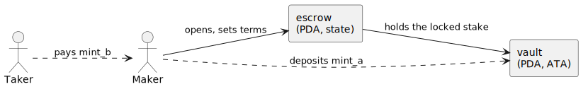
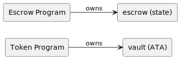
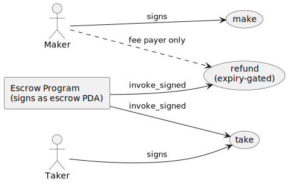
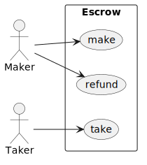
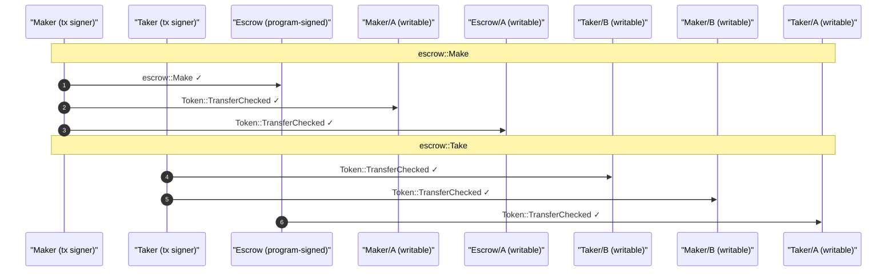

# Escrow: Make, Take, Refund

Escrow is where [Accounts as Actors](../running/accounts-as-actors.md) becomes concrete: two people who don't trust each other, a program holding the stakes, a vault custodying the tokens. A `maker` locks some `mint_a` into a vault and states what they want back in `mint_b`; a `taker` fills the order; or, once the offer expires, the `maker` refunds. Every snippet is included from [`book/listings/escrow`](https://github.com/cds-rs/anchor-litesvm/tree/turbin3/book/listings/escrow), a complete project CI builds and tests; clone the repo, `cd` in, and `cargo test` to run the suite yourself.

## How we model it

A trade in two tokens, escrowed by the program so neither party has to trust the other. The **maker** locks a `deposit` of `mint_a` into a **vault** (a token account the escrow PDA owns) and opens an **escrow** account recording the terms: how much `mint_b` they want back. A **taker** fills the order by paying that `mint_b` to the maker and taking the `mint_a` from the vault. If no taker shows up before the offer expires, the maker refunds.

## The cast of characters

| Actor | Kind | Role |
| --- | --- | --- |
| **Maker** | user (signer) | locks the stake, sets the terms, can refund after expiry |
| **Taker** | user (signer) | fills the order |
| **mint_a / mint_b** | mints | the two sides of the trade |
| **escrow** | PDA (program account) | records the terms (seed, maker, mints, amount, expiry) |
| **vault** | PDA (token account) | holds the maker's locked `mint_a` |



## Ownership

The vault holds the maker's tokens, but the **Token program** owns it (it's a token account); the escrow program owns only the `escrow` state account. The escrow program moves the vault's tokens by signing as the escrow PDA, the same owner-versus-controller split the [vault example](vault.md) introduced.



## Authority

Each instruction has a different signer. `make` is signed by the maker (it's their stake). `take` is signed by the taker (it's their fill). `refund` declares no signer at all: it's gated on expiry, and the maker is only the fee payer, so the program pays the right maker via a `has_one` constraint rather than a signature.



## The use cases



## The shared bundle

```rust
{{#include ../../listings/escrow/programs/escrow/src/test_helpers.rs:bundle}}
```

One bundle names every account in the trade. Each instruction's `From` impl (the [bundle derive](../instructions/bundled-pubkeys.md)) takes the subset it needs, so `make`, `take`, and `refund` all build from the same `EscrowBundle`. The `AliasMirror` derive registers the whole cast in the alias table in one call.

## The cast

```rust
{{#include ../../listings/escrow/programs/escrow/tests/common/mod.rs:setup}}
```

The leaves name themselves as they are cast (`cast_actor("Maker")`, `cast_mint("A", ...)`), then `alias_ata` composes each token account's name from its owner and mint (`Maker/A`, and the vault as `Escrow/A`), so the rendered trace never shows a raw pubkey. Every cast derives its address from its name, so committed output diffs cleanly. The maker's `mint_a` source is funded with `DEPOSIT` and the taker's `mint_b` with `RECEIVE`; the program creates the remaining ATAs as it needs them.

## Make: a narrated test

`make(seed, receive, deposit)` records the terms in the escrow account and moves the deposit into the vault. Here's the whole test:

```rust
{{#include ../../listings/escrow/programs/escrow/tests/test_make.rs:make}}
```

The `Report` recorder threads a narrative through the test with four calls:

- **`md.step("...")`** records a heading for each phase (Before / Action / After).
- **`md.snapshot("balances", &...)`** captures a labelled table of token balances at that moment, so the report shows the deposit move from end to end.
- **`md.check("escrow.receive", RECEIVE, escrow_acct.receive)`** is an assertion *and* a recorded line: it fails the test on mismatch, and either way writes a pass/fail row into the report.
- **`.print_markdown_pair()`** after the send appends the transaction's [CPI tree](../inspect/cpi-tree.md) and a balances pair, in cast names.

The whole thing emits to `target/md-reports/<slug>.md`: a readable record of exactly what the test did, byte-stable across runs (deterministic identities), so it diffs cleanly in review.

<details> <summary>The recorded run: <strong>make</strong> creates the escrow and funds the vault</summary>

> The maker opens an escrow offering `deposit` of mint_a in exchange for `receive` of mint_b. `make` records the terms in the escrow account and moves the full deposit from the maker's source ATA into the vault (an ATA owned by the escrow PDA).

**Before: maker holds the deposit, vault does not exist yet**

| account | amount |
|---|---|
| Maker mint_a | 1000000 |
| Maker mint_b | — |
| Taker mint_a | — |
| Taker mint_b | 2000000000 |
| Vault mint_a | — |

**Action: maker calls make(seed, receive, deposit)**

**After: escrow records the terms; the deposit sits in the vault**

| account | amount |
|---|---|
| Maker mint_a | 0 |
| Maker mint_b | — |
| Taker mint_a | — |
| Taker mint_b | 2000000000 |
| Vault mint_a | 1000000 |

- [x] escrow.seed: `42`
- [x] escrow.receive: `2000000000`
- [x] vault holds the deposit: `Some(1000000)`
- [x] maker source drained: `Some(0)`
</details>

## Take: fill the order

```rust
{{#include ../../listings/escrow/programs/escrow/tests/test_take.rs:take}}
```

The taker pays `receive` of `mint_b`, receives the `deposit` of `mint_a`, and the vault closes. `Take` makes several token-program CPIs, so its CPI tree reads as a sequence of named transfers, and the [authority graph](../inspect/graphs.md) shows `Taker` signing while the escrow program writes the vault.

<details> <summary>The recorded run: <strong>take</strong> settles the swap on the last day of the window</summary>

> With an open escrow, the taker calls take: they pay `receive` of mint_b to the maker and receive the vault's full mint_a deposit; the vault then closes. Run at day 89 of the 90-day window to pin the expiry boundary: take is still allowed on the last day.

**Setup: maker opens the escrow (make funds the vault)**

| account | amount |
|---|---|
| Maker mint_a | 0 |
| Maker mint_b | — |
| Taker mint_a | — |
| Taker mint_b | 2000000000 |
| Vault mint_a | 1000000 |

**Advance to day 89 (still inside the 90-day window)**, one day short of expiry to guard an off-by-one in the `< expiry` check.

**Action: taker calls take**

**After: the two-sided swap settled; vault closed**

| account | amount |
|---|---|
| Maker mint_a | 0 |
| Maker mint_b | 2000000000 |
| Taker mint_a | 1000000 |
| Taker mint_b | 0 |
| Vault mint_a | — |

- [x] taker received the deposit (mint_a): `Some(1000000)`
- [x] maker received the price (mint_b): `Some(2000000000)`
- [x] taker's mint_b fully spent: `Some(0)`
- [x] vault account closed: `true`

The account index and authority diagram for this run are in [What the views show](#what-the-views-show) below.
</details>

## Refund: reclaim after expiry

Refund is the maker's recovery path, gated on time: allowed only once the offer's window has closed, so a maker can't yank the deposit out from under a taker mid-trade. `advance_days` jumps the clock past expiry:

```rust
{{#include ../../listings/escrow/programs/escrow/tests/test_refund.rs:refund}}
```

<details> <summary>The recorded run: <strong>refund</strong> returns the deposit after expiry and closes the escrow</summary>

> When no taker shows up before the 90-day window closes, the maker recovers: refund (allowed only once expired) returns the vault's full mint_a to the maker and closes the vault + escrow (rent back to the maker).

**Setup: maker opens the escrow (deposit now in the vault)**

| account | amount |
|---|---|
| Maker mint_a | 0 |
| Maker mint_b | — |
| Taker mint_a | — |
| Taker mint_b | 2000000000 |
| Vault mint_a | 1000000 |

**Advance 199 days (past the 90-day window, so refund is allowed)**

**Action: maker calls refund**, which declares no Signer; the maker signs only as the transaction fee payer.

**After: deposit back with the maker; vault + escrow closed**

| account | amount |
|---|---|
| Maker mint_a | 1000000 |
| Maker mint_b | — |
| Taker mint_a | — |
| Taker mint_b | 2000000000 |
| Vault mint_a | — |

- [x] maker recovered the deposit: `Some(1000000)`
- [x] vault account closed: `true`
- [x] escrow account closed: `true`
</details>

<div class="callout scandal">

**The Betrayal.** Inside the window, the same call is the maker pulling the deposit out from under a would-be taker, and it is rejected:

</div>

```rust
{{#include ../../listings/escrow/programs/escrow/tests/test_refund.rs:negative}}
```

`send_err_named("EscrowNotExpired")` asserts the transaction failed with that specific error, so a refactor that changes which guard fires breaks the test loudly.

## What the views show

These are the [actual rendered output](../inspect/graphs.md#the-per-test-execution-snapshot) of `take`'s `ctx.report_execution(&mut md)`, not a description. The **authority flow** (`ctx.authority_story()`) traces the whole trade, the `make` deposit and the `take` settlement, as signed transfers in cast names:



The last line is the trust point: `Escrow ->> Taker_A`, the program signing as the escrow PDA to release the vault to the taker. The **account index** (`ctx.account_index()`) is the ownership view, every account under its owner:

```text
Maker  (human signer, owned by System)
  ├── Maker/A  (ATA · mint A)
  └── Maker/B  (ATA · mint B)
Taker  (human signer, owned by System)
  ├── Taker/A  (ATA · mint A)
  └── Taker/B  (ATA · mint B)
Escrow  (program-signed, owned by escrow)
  └── Escrow/A  (ATA · mint A)
A  (passive, owned by Token)
B  (passive, owned by Token)

── programs ──
System  (owns Maker, Taker)
Token  (owns 7 accounts)
escrow  (owns Escrow)
AssociatedToken  (derived 5 ATA edges)
```

The vault (`Escrow/A`) is owned by the **Token program**, even though the escrow program is what moves it. The next example, [CPAMM](cpamm.md), scales the same pattern to a pool with a cast that no longer fits on a sticky note.
