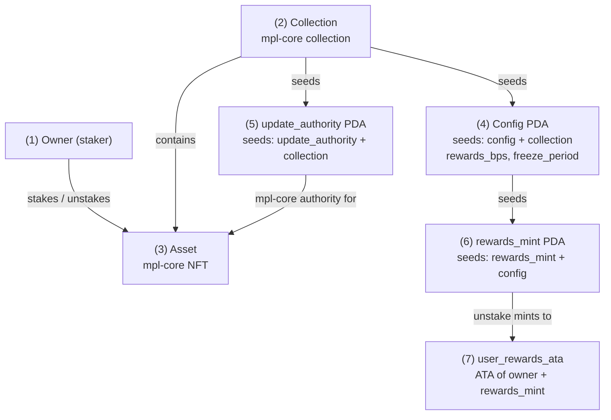

# Stake

<details>
<summary>Your starting point</summary>

The staking program's full source, a standard Anchor program with no tests, at
`examples/staking/`. It CPIs into mpl-core, so that program's `.so` is committed
alongside. The built fixtures are committed too, so a fresh clone runs this
chapter's test without building anything:

```bash
git clone -b feat/buildable-ix https://github.com/cds-rs/anchor-litesvm
cd anchor-litesvm
cargo test -p anchor-litesvm --test book_stake
```

```text
examples/staking/                                the program source (no tests)
crates/anchor-litesvm/tests/fixtures/staking.so  the built program
crates/anchor-litesvm/tests/fixtures/mpl_core.so the mpl-core CPI callee
crates/anchor-litesvm/tests/book_stake.rs        this chapter's test
```

Changed the program? Rebuild the fixture with `cd examples/staking && anchor build`.

</details>

The staking program lets a holder stake an mpl-core NFT into a collection
and earn rewards. `create_collection` and `mint_asset` set up the NFT side
of things; `initialize` opens a `config` PDA on the collection with a
rewards rate and a freeze period, in days; `stake` freezes an asset in place
and records when; `unstake`, once that freeze period elapses, unfreezes it
again and mints the rewards.

This is the deepest CPI tree in the book: mpl-core assets are only mutable
through CPIs into the mpl-core program itself, so nearly everything `stake`
and `unstake` do to the NFT shows up as a nested frame rather than as a
direct account write in `staking`'s own frame.

## The accounts

Three PDAs hang off the collection and the config, and the asset lives inside
mpl-core; that shape is what makes the CPI tree deep.



The owner (1) stakes an asset (3), an mpl-core NFT that belongs to a collection
(2). Two PDAs are seeded off that collection: config (4) holds the staking
terms (the rewards rate and the freeze period), and update_authority (5) is a
PDA the program controls, set as the collection's mpl-core update authority
when `create_collection` runs. That authority is what lets `staking` sign the
plugin adds and updates that freeze and unfreeze the asset, which is what the
deep CPI tree below is made of. rewards_mint (6) is seeded off config, and
`unstake` mints from it into the staker's ATA (7).

`staking` depends on `mpl-core`, whose crate is pinned to anchor 0.31, so it
builds under its own 0.31 toolchain rather than in this anchor 1.0 workspace.
That version gap looks like it should block the typed client; it does not.
`staking`'s IDL is spec `0.1.0`, the same format anchor 1.0 emits. The one
snag is a name clash: the IDL embeds mpl-core's `Key` enum, which collides
with `anchor_lang`'s `Key` trait once `declare_program!` glob-imports both,
and current rustc rejects the ambiguous glob. `make fixtures` runs the
framework's sanitize pass (`anchor_litesvm::sanitize_idl`) over
`idls/staking.json`, which namespaces `Key` to `StakingKey`. With that, the
typed client generates like vault's and escrow's, and this chapter drives
`staking` the same way they drive their programs: a bundle and typed args per
instruction, no hand-built bytes.

## The typed client

`declare_program!(staking)` generates the typed client from the sanitized
IDL, and `bundles_from_idl!(staking)` generates an account bundle per
instruction. So a `stake` call is a `StakeBundle` plus its (empty) args:

```rust
// crates/anchor-litesvm/tests/book_stake.rs
anchor_lang::declare_program!(staking);
anchor_litesvm::bundles_from_idl!(staking);

fn stake_bundle(admin: &Keypair, asset: &Keypair, collection: &Keypair) -> StakeBundle {
    StakeBundle {
        owner: admin.pubkey(),
        asset: asset.pubkey(),
        collection: collection.pubkey(),
    }
}
```

`StakeBundle` carries only the three accounts that vary per call: the owner
and the two mpl-core assets. `config` and the update-authority PDA are both
seeded off `collection`, so the bundle derives them from the IDL's seeds; you
never spell out the account list or the discriminator, and there is no
positional slot to get wrong.

## Two-program boot

```rust
// crates/anchor-litesvm/tests/book_stake.rs
/// Deploys both vendored programs and names the staking custom errors. The
/// framework has no errors-from-IDL helper yet, so `register_program_errors`
/// supplies the mapping (codes are declaration order from 6000, per
/// `error.rs`); that is what makes a failing leaf read as
/// `FreezePeriodNotElapsed` instead of `custom program error: 0x1775`.
fn boot() -> anchor_litesvm::AnchorContext {
    let mut ctx = AnchorLiteSVM::build_with_programs(&[
        (staking::ID, "staking", &common::fixture_bytes("staking")),
        (MPL_CORE_ID, "mpl_core", &common::fixture_bytes("mpl_core")),
    ]);
    ctx.register_program_errors(
        staking::ID,
        &[
            (6000, "InvalidOwner"),
            (6001, "InvalidUpdateAuthority"),
            (6002, "AlreadyStaked"),
            (6003, "AssetNotStaked"),
            (6004, "InvalidTimestamp"),
            (6005, "FreezePeriodNotElapsed"),
            (6006, "InvalidRewardsBps"),
            (6007, "NothingToClaim"),
        ],
    );
    ctx
}
```

`build_with_programs` deploys the staking program alongside `mpl_core`:
staking CPIs into it for every NFT operation, so both programs need to be
live on the SVM for any of this to run.

The IDL carries staking's error names, but the framework has no helper to
source them yet, so `register_program_errors` supplies the mapping, read
straight off staking's own `error.rs`. That's what turns a failing leaf into
`FreezePeriodNotElapsed` instead of the far less readable `custom program
error: 0x1775`.

## Happy path

```rust
// crates/anchor-litesvm/tests/book_stake.rs
let mut ctx = boot();
let admin = ctx.cast_actor("Alice");
let (collection, asset) = setup(&mut ctx, &admin);

let result = ctx
    .tx(&[&admin])
    .build(
        stake_bundle(&admin, &asset, &collection),
        staking::client::args::Stake {},
    )
    .send_ok();
```

`setup` runs the first three calls through their own bundles: `create_collection`
mints a fresh mpl-core collection asset (the container `stake` attaches NFTs
to), `initialize` opens the `config` PDA on it with a 500bps rewards rate and
a 7-day freeze period, and `mint_asset` mints an NFT into the collection. Then
`stake` freezes it in place.

`result.tree_string()` renders the last of those four calls, `stake`:

```text
{{#include ../captured/stake.txt}}
```

`staking::Stake` CPIs into `mpl_core::AddPlugin` twice, once per plugin it
attaches: first the Attributes plugin, which records `staked` and
`staked_at` as data on the asset, then the FreezeDelegate plugin, which is
what actually freezes the asset in place. Both effects show up as nested
frames rather than as writes inside `staking`'s own frame, because that's
the only way `staking` is allowed to touch someone else's mpl-core asset.

Each `AddPlugin` call, in turn, touches `System` to resize the asset
account: attaching a plugin grows the account's stored data, and the extra
rent that growth requires gets funded through a `System` transfer CPI.

## Freeze lock

A staker who tries to unstake before the freeze period elapses gets turned
away. `unstake` reads the current clock, works out how many days have
passed since `stake` recorded `staked_at`, and requires that count to reach
`initialize`'s 7-day freeze period before it will touch the asset at all:

```rust
// crates/anchor-litesvm/tests/book_stake.rs
// Only 1 of the 7 freeze-period days has elapsed.
ctx.svm.advance_days(1);
let ix = ctx.program().build_ix(
    unstake_bundle(&admin, &asset, &collection),
    staking::client::args::Unstake {},
);
let result = ctx.send_err_named(ix, &[&admin], "FreezePeriodNotElapsed");
```

```text
{{#include ../captured/stake_freeze_locked.txt}}
```

The `AssociatedToken` frame still runs and succeeds: `unstake` creates the
staker's rewards ATA before it ever checks the freeze period, the same
create-first, guard-second ordering the escrow chapter's expiry check
showed. Then the `✗ FreezePeriodNotElapsed` leaf stops the transaction,
with 6 of the 7 freeze-period days still owed.

Give `unstake` the days it's owed, and the very same call succeeds:

```rust
// crates/anchor-litesvm/tests/book_stake.rs
// 8 of the 7 freeze-period days have elapsed.
ctx.svm.advance_days(8);
let result = ctx
    .tx(&[&admin])
    .build(
        unstake_bundle(&admin, &asset, &collection),
        staking::client::args::Unstake {},
    )
    .send_ok();
```

```text
{{#include ../captured/stake_unstake_ok.txt}}
```

Past the freeze period, `unstake` runs to completion. The first
`mpl_core::UpdatePlugin` call resets the Attributes plugin's `staked` /
`staked_at` values, undoing what `stake`'s first `AddPlugin` call recorded.
The second `UpdatePlugin` call sets `FreezeDelegate.frozen` back to `false`,
unfreezing the asset. The final `Token` call is the payoff: it mints the
staking rewards to the staker's ATA, at the rewards rate `initialize` set
back at the start of the chapter.

The full test is `crates/anchor-litesvm/tests/book_stake.rs`.
