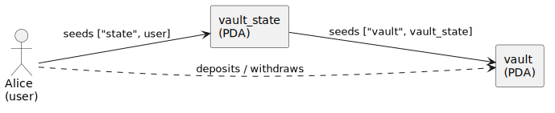
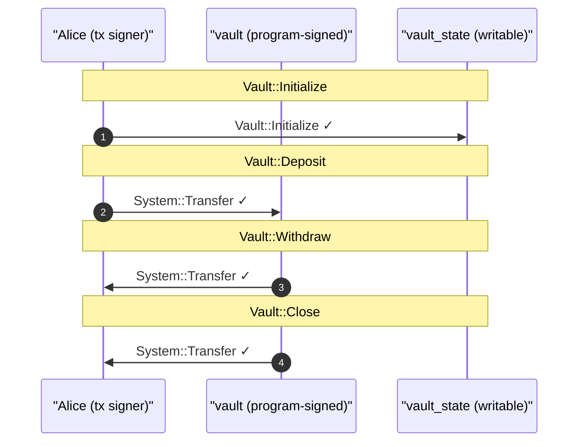

# Vault: Deposit & Withdraw

Our first case study, and the gentlest. A **vault holds SOL** for a single user: they open a personal vault, deposit lamports, withdraw them, and finally close it (reclaiming rent and the remainder). One actor, no SPL tokens. Every snippet here is included from [`book/listings/vault`](https://github.com/cds-rs/anchor-litesvm/tree/turbin3/book/listings/vault), a complete project CI builds and tests; clone the repo, `cd` in, and `cargo test` to run it yourself. Before any test code, let's model the thing.

## How we model it

Two program-derived accounts, with different jobs:

- The **vault** holds the money. Its lamport balance *is* the deposit. It's a `SystemAccount`, so the System program owns it; the vault program controls it by signing as its PDA.
- The **vault_state** records the two bump seeds the program needs to re-derive both PDAs. It's a normal Anchor account the vault program owns.

## The cast of characters

| Actor | Kind | Role |
| --- | --- | --- |
| **Alice** | user (signer) | opens the vault, pays every fee, deposits and withdraws |
| **vault** | PDA (`SystemAccount`) | custodies the lamports |
| **vault_state** | PDA (program account) | stores the bumps |

The two PDAs are derived in a chain: `vault_state = ["state", user]`, then `vault = ["vault", vault_state]`. The vault is keyed off the *state* PDA, not directly off the user, so the derivation order matters.



## Ownership

Who *owns* each account is not who you'd guess. The vault holds Alice's money, but Alice does not own it, and neither does the vault program: the **System program** owns it (it's a `SystemAccount`). The program owns only the `vault_state`.


## Authority

Who *authorizes* each money movement is the matching half. A deposit is authorized by Alice's transaction signature (it's her SOL going in). A withdrawal is authorized by the program signing *as the vault PDA* (an `invoke_signed`), because the PDA can't hold a keypair. Deposit-in by the user, payout-out by the program.


## The use cases


The rest of the chapter writes a test for each, and the [closing views](#what-the-views-show) recover the ownership and authority relationships above *from the executed transaction*, confirming the model against reality.

## The bundle

```rust
{{#include ../../listings/vault/programs/vault/src/test_helpers.rs:bundle}}
```

Three fields, one per account the test varies. `system_program` isn't among them: every accounts struct declares it as `Program<'info, System>`, and the derive fills its canonical id. The module is host-only:

```rust
{{#include ../../listings/vault/programs/vault/src/lib.rs:wire}}
```

Each accounts struct carries the `cfg_attr` that points back at `VaultAccs`. Here is `Initialize` (the other three wire up the same way):

```rust
{{#include ../../listings/vault/programs/vault/src/instructions/initialize.rs:accounts}}
```

On host builds the `cfg_attr` derives `BundledPubkeys`; on the BPF build it vanishes. The full machinery is the [bundled-pubkeys chapter](../instructions/bundled-pubkeys.md).

## Setup

The test imports from the program crate and casts one funded actor:

```rust
{{#include ../../listings/vault/programs/vault/tests/test_initialize.rs:setup}}
```

`cast_actor_with_sol` casts Alice in one call: a deterministic keypair (byte-stable across runs), funded with 10 SOL, and aliased under her name. With Alice in hand, derive the two PDAs (state first, then vault off the state), alias them, and build one bundle to reuse:

```rust
{{#include ../../listings/vault/programs/vault/tests/test_initialize.rs:pdas}}
```

## Initialize

```rust
{{#include ../../listings/vault/programs/vault/tests/test_initialize.rs:init}}
```

`ctx.tx(&[&alice])` lists the signers, `.build(accs, vix::Initialize {})` projects the bundle and serializes the args, `.send_ok()` sends and asserts success. The vault state now exists, and its bumps read back.

## Deposit

```rust
{{#include ../../listings/vault/programs/vault/tests/test_initialize.rs:deposit}}
```

Deposit is a System transfer: the program CPIs into `System::Transfer`, the first nesting the [CPI tree](../inspect/cpi-tree.md) shows. Alice signs, and the transfer moves her SOL, so the deposit's authority is hers.

## Withdraw

```rust
{{#include ../../listings/vault/programs/vault/tests/test_initialize.rs:withdraw}}
```

Withdraw is the mirror, with one difference: the vault PDA *signs* the transfer out. The program holds the vault's seeds and signs the `System::Transfer` as the vault (an `invoke_signed`). The CPI tree looks like deposit's, but the signer is reversed, and a bare log line carries no signer either way. Recovering "the program signed as the vault PDA" is what the [authority graph](../inspect/graphs.md) does.

## Close

```rust
{{#include ../../listings/vault/programs/vault/tests/test_initialize.rs:close}}
```

Close drains the vault (a PDA-signed transfer) and shuts the state account via Anchor's `close = user`, refunding its rent to Alice. `get_balance` returns `Option<u64>` (a closed account is `None`), so we `.unwrap()` Alice's, which is always funded. She ends with more than before the close: the remaining lamports plus the reclaimed rent.

## A negative probe

<div class="callout scandal">

**Mistaken Identity.** Throwaway pubkeys stand in for the seed-constrained vault accounts:

</div>

```rust
{{#include ../../listings/vault/programs/vault/tests/test_initialize.rs:negative}}
```

`..VaultAccs::default()` fills `vault` and `vault_state` with throwaway `Pubkey::new_unique()` placeholders. Every account except the signer is seed-constrained, so Anchor's seeds check rejects them, and `send_err_named("ConstraintSeeds")` asserts that specific failure rather than any error.

## What the views show

One call at the end of the test emits the snapshot:

```rust
{{#include ../../listings/vault/programs/vault/tests/test_initialize.rs:report}}
```

These aren't descriptions; they're its [actual rendered output](../inspect/graphs.md#the-per-test-execution-snapshot), byte-stable because Alice's identity is deterministic. The **authority flow** (`ctx.authority_story()`) recovers who signed each transfer from the execution alone:



Read top to bottom: Alice signs `Initialize`, then `Deposit` moves her SOL into the vault. Then the flip: `Withdraw` and `Close` are `vault ->> Alice`, the program signing as the vault PDA to pay her back. Deposit-in by the user, payout-out by the program.

The **account index** (`ctx.account_index()`) is the matching ownership view, who owns each account versus who merely wrote it:

```text
Alice  (human signer, owned by System)
vault  (program-signed, owned by System)
vault_state  (program-signed, owned by Vault)

── programs ──
System  (owns Alice, vault)
Vault  (owns vault_state)
```

The vault is owned by **System**, not the Vault program; the program owns only `vault_state`. A lamport vault is a System-owned account the program controls by PDA signing. PDA-*of* and owned-*by* are different.

When you're ready for a cast that doesn't trust each other, [Escrow](escrow.md) is next.
