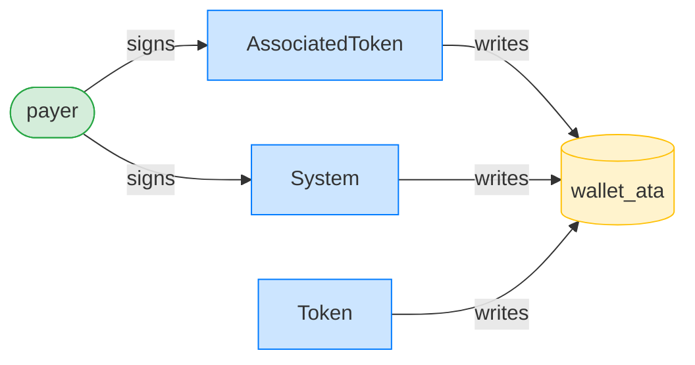
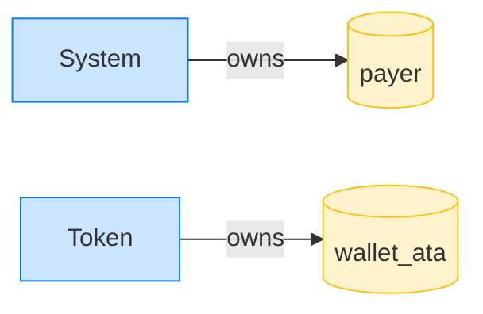

# Authority & Ownership Graphs

The [tree](cpi-tree.md) and the [sequence diagram](mermaid.md) both show a transaction as a sequence of *calls*. The two graph views answer different questions, about *accounts* rather than calls: who's allowed to do what (authority), and who owns the state that changed (ownership). They're the views that catch a class of bug the call-oriented views can't.

Both emit Mermaid ```flowchart blocks, so like the sequence diagram they render wherever markdown does. We'll use the same ATA-creation transaction throughout, because it's a small example that still shows the interesting gap.

## The authority graph

`result.print_authority_graph()` draws `signer --signs--> program --writes--> account`: who signed, and what state each program wrote.



Reading it: the green `payer` (a signer) signs to the `AssociatedToken` and `System` programs; three programs all *write* the yellow `wallet_ata`. The node shapes encode roles (stadium for signers, box for programs, cylinder for writable accounts), and the colors match.

What it includes and drops:

- A signer account draws a `signs` edge to the program it's a required signer for.
- A writable non-signer account draws a `writes` edge *from* the program.
- Read-only non-signer accounts are dropped, to keep the graph about authority and state change rather than every account the instruction merely referenced.
- A pubkey seen in more than one role is drawn once, at its highest precedence (`program > signer > writable`), and edges dedup across frames.

<div class="callout spotlight">

**N.B.** The same caveat as the tree's `signer=`: "signs" is the account-list relationship (X is a required signer referenced by an instruction to program P), not a claim about intent. A writable signer like a fee payer renders as a signer; its writability is left implicit.

</div>

## The ownership graph

`result.print_ownership_graph(&ctx.svm)` draws `owner-program --owns--> account` for each *written* account: which program the account's `owner` field points at (the program allowed to mutate it).



## The payoff: owner is not writer

Put the two graphs side by side and you see the thing this view exists for. In the authority graph, the `wallet_ata` is *written* by three programs, and the one that does the actual `CreateAccount` is **System**. But in the ownership graph, `wallet_ata` is *owned* by **Token**.

That's not a contradiction; it's how Solana account creation works. The AssociatedToken program orchestrates; the System program does the `CreateAccount` (it's the writer); and the account ends up owned by the Token program (the owner). The writer and the owner are different programs, and that difference is **invisible from the logs alone**. Seeing it needs the post-execution account state, which is why these two graphs come as a pair.

This owner-versus-writer gap trips up a lot of people new to Solana ("why does System write a token account?"), and seeing it drawn is the quickest way past the confusion.

## Why ownership needs `&svm` and the others don't

You'll have noticed `print_ownership_graph` takes `&ctx.svm` while every other render method takes nothing. That's the one asymmetry in the rendering API, and it's structural: an account's owner is *post-execution state*, not something in the transaction logs or the message. The tree, the sequence diagram, and the authority graph all read from data the transaction itself carries; ownership needs a `svm.get_account(pk).owner` lookup after the fact, so it needs the `svm`.

(This is documented as a stopgap in the renderer's design: the plan is to lobby litesvm to carry account-owner metadata on the CPI frame, at which point the second lookup, and the `&svm` parameter, would go away. The `account_graphs` example is the concrete artifact for that conversation. See [`docs/design/cpi-rendering.md`](https://github.com/cds-rs/anchor-litesvm/blob/turbin3/docs/design/cpi-rendering.md) for the full story.)

## String variants

`authority_graph_string()` and `ownership_graph_string(&svm)` return the fenced block as a `String` rather than printing, for asserting on or writing to a file.

## The per-test execution snapshot

Everything above renders *one* `TransactionResult`: the view you reach for mid-debug, on a single send. But a test usually sends several, and the artifact you want to commit is the *accumulated* picture across all of them. That's `ctx.report_execution(&mut md)`: one call on the context (not the result), which appends three blocks to a [`Report`](../appendix/conventions.md):

- **Authority flow** (`ctx.authority_story()`, via `md.authority`): a sequence diagram, one labelled section per transaction, tracing who signed each value movement and which movements the program signed as a PDA (`invoke_signed`). It answers the same question as the authority *graph* above, at a different altitude: the graph is one transaction's `signer → program → account` flowchart; the flow is the whole test's signed-transfer sequence.
- **Account index** (`ctx.account_index()`): the accumulated, text counterpart to the ownership *graph*; every account the test touched, filed under its owner program, with ATA parent edges recovered.
- **Structured logs**: the [CPI tree](cpi-tree.md) for every send, in submission order.

Because the identities are deterministic (the [test-output conventions](../appendix/conventions.md) cover the discipline), the snapshot is byte-stable, so a change in its diff is a change in behavior. This is what every [worked example](../examples/vault.md) renders in its "What the views show" section. Reach for the per-transaction methods to debug a single send; reach for `report_execution` to commit the shape of the whole scenario.
