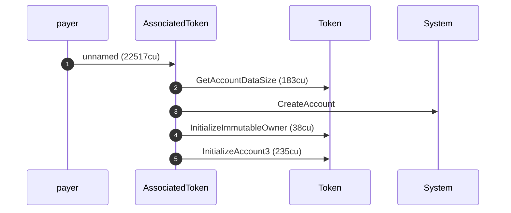
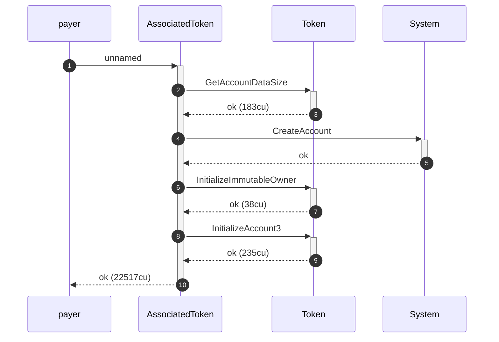

# Mermaid Sequence Diagrams

The [CPI tree](cpi-tree.md) is the right view for a terminal. But when you want to put a transaction's call structure into something that *renders*, a PR description, an issue, this book, the sequence-diagram view is better. `result.print_mermaid()` emits a fenced ```mermaid block; drop it anywhere markdown renders (GitHub, mdBook, your editor's preview) and it becomes a diagram.

The text the method prints *is* the fenced block below; what you see rendered is what a reader of your PR sees.

## Plain mode

`print_mermaid()` gives one arrow per CPI edge, fire and forget. Here's the real output for the same ATA creation from the previous chapter:



Each `->>` is a call, labelled with the instruction name and (where the program emitted one) its compute. The participants are your actors, in alias names, so the diagram reads in the cast you set up. It's compact and good for answering "what got called, in what order."

> **N.B.** An arrow's *source* is the caller, not the owner or authority of its target. At the top level that's the transaction's signer; one level down it's the *calling program* (`AssociatedToken ->> System` means AssociatedToken *invoked* System, not that it owns or controls it). Who owns an account, or authorized a change, is a separate question with a separate view: the [authority and ownership graphs](graphs.md) read the signer set and post-execution account state, where this diagram reads only the call tree.

**A limitation to be aware of:** The root arrow reads `unnamed (22517cu)`: the top-level instruction name isn't resolved. The tree's *header* decodes that name (it had `AssociatedToken::Create`), but the sequence renderer labels the root arrow from the frame's own resolved name, which is absent for a bare SPL root like this one. For an Anchor instruction (which emits `Program log: Instruction: <Name>`) the root arrow is named. The label is the word `unnamed` rather than a bare `?` on purpose: a Mermaid message of just `?` (with no compute suffix to pad it) fails to parse on GitHub and drops the whole diagram to raw text.

**On the compute number:** this run says `22517cu` where the tree chapter's run said `15017cu` for the "same" transaction. That's not an inconsistency in the book; it's two separate runs with fresh random pubkeys, and per-run CU drift is real (Anchor's `find_program_address` iterates a variable number of bumps for different pubkeys). [Reading Compute & Fees](compute-fees.md) covers why you should never diff these across runs.

## Lifelines mode

`print_mermaid_with_lifelines()` makes the synchronous nesting visible: paired `->>+` (call, activate) and `-->>-` (return, deactivate) arrows, so you see a parent staying active while its children run.



The return arrow (`-->>-`) carries the outcome: `ok (Ncu)`, or the error on a failure. Notice the children render *before* the parent's return line. That's deliberate and chronologically faithful: Solana runs the inner CPIs before the parent's post-CPI checks fire, so the parent's `ok` lands last. The lifelines view is the one to use when the *nesting* matters (a deep CPI chain, a router calling a pool calling a token program); the plain view is better when you just want the call list.

## Events and logs

`Program data:` events surface as informational dashed arrows back to the transaction initiator. `Program log:` lines are opt-in (they're verbose): set `ANCHOR_LITESVM_MERMAID_LOGS` in the environment to include them. Off by default, because most of the time the call structure is what you're after, not the log spew.

## The string variants and the markdown pair

`mermaid_string()` and `mermaid_string_with_lifelines()` return the fenced block as a `String` instead of printing it. And `print_markdown_pair()` is the convenience for documentation: it emits the [tree](cpi-tree.md) in a ```console fence followed by the lifelines diagram in a `<details>` block, so `cargo test -- --nocapture` output drops straight into a markdown file with the diagram collapsed by default. This is how you'd attach a transaction's shape to a bug report.
