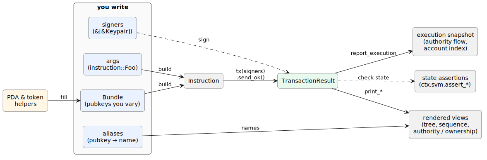

# How It Fits Together

You've written one test. Before the rest of the book takes each piece apart, here's the whole vocabulary on one page, and how the pieces connect. Every term links to the chapter that covers it in depth.



## What you write

Five things, and the framework asks for nothing else:

- **Bundle**: a struct of the pubkeys your test varies, one named field per account. The spine of the whole library; [Part II](../instructions/named-accounts.md) is four views of it.
- **args**: your program's generated `instruction::Foo` struct, paired to the bundle at the type level so a mismatch is a compile error. [The builder](../instructions/builder.md).
- **signers**: the `Keypair`s that authorize the transaction. The bundle holds pubkeys; signing is separate. [Executing](../running/executing.md).
- **aliases**: `ctx.alias(pubkey, "maker")`, the names the rendered output reads back to you. [Accounts as actors](../running/accounts-as-actors.md).
- **helpers**: `ctx.svm.create_token_mint`, `get_pda`, and friends produce the pubkeys that fill the bundle. [PDAs & tokens](../instructions/pdas-and-tokens.md).

## What the framework gives back

Hand it those five, and it produces the rest:

- **build**: bundle + args become an `Instruction`, accounts ordered by the program itself, not by you. [Named accounts](../instructions/named-accounts.md), [the derive](../instructions/bundled-pubkeys.md).
- **tx / send**: `ctx.tx(signers).build(..).send_ok()` builds, sends, and asserts the outcome in one chain. [Executing](../running/executing.md).
- **TransactionResult**: what a send returns; the logs, the compute, the outcome, and the handle every view hangs off. [Executing](../running/executing.md).
- **rendered views**: the CPI tree, sequence diagram, and authority/ownership graphs of a single transaction, in your alias names. [Part IV](../inspect/cpi-tree.md).
- **execution snapshot**: `ctx.report_execution(md)`, the authority flow and account index across the whole test, committable and diffable. [Authority & ownership](../inspect/graphs.md#the-per-test-execution-snapshot).
- **state assertions**: `ctx.svm.assert_*`, the other half of every test; did the world end up where you expected. [Assertions](../running/assertions.md).

## The domain you get to stay in

The two lists above are mechanics: tokens in, artifacts out. What they buy you is the freedom to reason about your program in its own language instead of the machine's.

Every system worth testing has a *domain-specific language* (DSL): the few concepts that are the natural vocabulary of its problem. Reason outside them and you quietly start solving the wrong problem. Solana's are **accounts, ownership, authorities, and transactions**; that's what the runtime thinks in, and what its security properties are stated in. Describe a test in bare pubkeys and an ordered `Vec<AccountMeta>` and it still runs, but you've left that vocabulary: a reader has to translate base58 and slot positions back into "who owns this, who signed, what moved" before they can judge whether the test is even right.

Naming the cast puts the test back in the runtime's language. The same test, twice:

```rust
// Plumbing: correct, but you reason in positions and base58.
let accounts = vec![
    AccountMeta::new(payer.pubkey(), true),   // who? authorizing what?
    AccountMeta::new(vault_pda, false),        // position 1 means what?
    AccountMeta::new_readonly(system_program::ID, false),
];

// Domain: a named cast and a named verb. The accounts, the ordering, and
// the program ids stay in the code; the test reads as a sentence.
let alice = ctx.cast_actor("Alice");
open_and_fund_vault(&mut ctx, &alice, 1_000_000);   // a verb your suite owns
```

Two things follow. The questions the test provokes become *domain* questions, the ones worth a team's time: which vault? why does Alice both open and fund it, rather than Alice opening and Bob funding? Those are design decisions, visible because the test speaks the domain. And because the domain vocabulary is where a system's invariants live, a test phrased in it asks the right questions by default, what states are valid, what transitions are allowed, what must hold, instead of what bytes sit where.

A heuristic worth keeping: **bugs hide where the implementation and the domain language disagree.** A test written in the domain sits right on that seam, so a divergence (an authority that shouldn't sign, an account owned by the wrong program) reads as a sentence that's wrong, not a byte you'd decode and *hope* to notice. The named views from the last section are what make it legible. The DSL is the shortest path between your code and the truth the runtime is actually enforcing.

So the arc, in full: helpers fill a **bundle**, the bundle and **args** **build** an instruction, you **send** it with **signers** and get a **TransactionResult**, your **aliases** turn that into views you can read, and because every piece is named, the whole thing reads as a sentence about your problem rather than your plumbing. The rest of the book is each of those words, and that sentence, in full.
