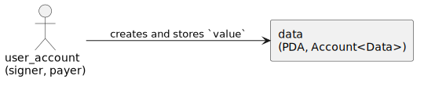
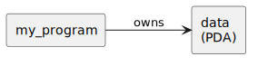
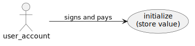
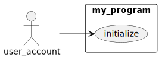
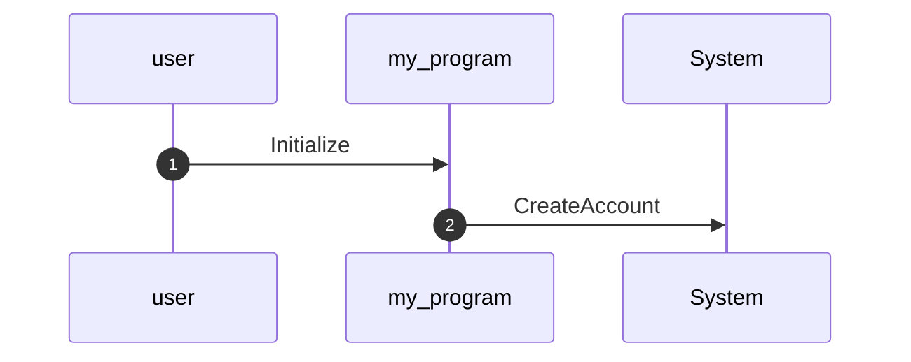
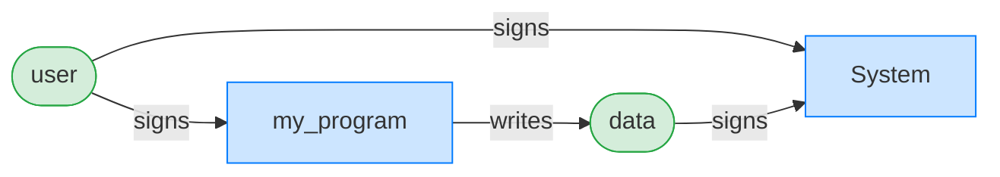
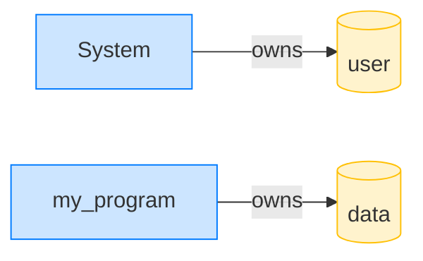

# Your First Test

A complete test you can copy and run. It deploys a program, creates an account, sends one instruction, and checks the result, the [shape every test takes](shape-of-a-test.md): arrange, act, assert.

`anchor init` scaffolds an `initialize` that does nothing, too thin to show anything off. So ours does a small real job: create a program-owned account and store a number in it. One instruction, but it exercises named accounts, an argument, a PDA, and on-chain state to assert on. (No tokens yet; those arrive as a [specialization](../instructions/specializations.md) once the shape is in hand.)

## How we model it

One instruction, `initialize`, that stores `value` in a new account. The **user_account** is the signer and the fee payer. The **data** account is a PDA the program creates and owns, holding the `value`; the handler writes the field, and Anchor's `init` constraint asks the **System program** to fund the new account's rent.

## The cast of characters

| Actor | Kind | Role |
| --- | --- | --- |
| **user_account** | signer | pays the fee and the new account's rent |
| **data** | PDA (`Account<Data>`) | the program-owned account that stores `value` |



## Ownership

The **data** account is owned by `my_program` itself: an `Account<Data>` belongs to the program that declares it. That's the common case, a program owns the state it creates; the [Vault example](../examples/vault.md) shows the surprising one, where the System program owns an account your program still controls.



## Authority

The user_account signs the transaction; that signature authorizes the instruction and pays for the new account.



## The use cases



## Set up the project

1. Generate the workspace:

   ```console
   anchor init my_program && cd my_program
   ```

2. Add the dependencies to `programs/my_program/Cargo.toml` ([Installation & Setup](installation.md) explains each one):

   ```toml
   [dependencies]
   anchor-lang = "1.0.2"

   # Host-only: the test harness, never compiled into the on-chain binary.
   [target.'cfg(not(target_os = "solana"))'.dependencies]
   anchor-litesvm = { git = "https://github.com/cds-rs/anchor-litesvm", branch = "turbin3" }
   ```

Now write the program.

## The program

The account it stores:

```rust
{{#include ../../listings/first-test/programs/my_program/src/state.rs:state}}
```

The accounts:

```rust
{{#include ../../listings/first-test/programs/my_program/src/instructions/initialize.rs:accounts}}
```

`user_account` signs and pays; `data` is the PDA the program creates and writes into. The `#[cfg_attr(...)]` line is the test hook: on host builds it derives `BundledPubkeys`, which lets a test drive this instruction from a bundle of pubkeys; on the BPF build it vanishes.

The handler stores `value` in the `data` account:

```rust
{{#include ../../listings/first-test/programs/my_program/src/instructions/initialize.rs:handler}}
```

The `#[account(init, ...)]` constraint does the heavy lifting: it creates the PDA, funds its rent from `user_account`, and sizes it (`8 + Data::INIT_SPACE`, the account discriminator plus the struct). The handler just writes the field.

The bundle that drives it lives in a host-only module:

```rust
{{#include ../../listings/first-test/programs/my_program/src/test_helpers.rs:bundle}}
```

`system_program` isn't a field. The derive reads its `Program<System>` type and fills the System program id, so tests never spell it. `#[derive(Bundle)]` also gives `InitAccs` a `Default`, so a test sets only the fields it varies and lets `..InitAccs::default()` cover the rest.

Wire the module in and call the handler:

```rust
{{#include ../../listings/first-test/programs/my_program/src/lib.rs:wire}}
```

```rust
{{#include ../../listings/first-test/programs/my_program/src/lib.rs:program}}
```

## The test

```rust
{{#include ../../listings/first-test/programs/my_program/tests/test_initialize.rs:test}}
```

Five things to know:

- The test imports from the program crate: `my_program::{instruction as vix, state::Data, test_helpers::InitAccs}`. No `declare_program!`, no generated client.
- `ctx.alias(pubkey, name)` registers a name for an account; every rendered view substitutes it for the base58, which is what the [last section](#what-the-framework-gives-back) shows.
- `ctx.tx(&[&user])` lists the signers, `.build(accs, args)` makes the instruction, `.send_ok()` sends it, asserts success, and returns the `TransactionResult` you render from.
- `get_pda(&[b"data", user.pubkey().as_ref()], &my_program::ID)` derives the PDA the same way the program does, so the test and the program agree on the address; `ctx.load::<Data>(&data)` reads it back to assert.
- The `include_bytes!` path is relative to the test file; the workspace `target/` is three directories up.

## Put it together and run it

Six snippets, five files. Starting from `anchor init my_program`, here is where each one goes:

```text
my_program/
├── Cargo.toml                          # dependencies (see Installation & Setup)
└── programs/my_program/
    ├── src/
    │   ├── lib.rs                       # `pub mod test_helpers;` + the #[program] handler
    │   ├── state.rs                     # the Data account
    │   ├── instructions/initialize.rs   # the Initialize accounts struct + handler
    │   └── test_helpers.rs              # the InitAccs bundle
    └── tests/
        └── test_initialize.rs           # the test
```

Then build the program and run the test:

```bash
anchor build      # compiles programs/my_program to target/deploy/my_program.so
cargo test        # builds the test against that .so and runs it
```

```text
test test_my_first_instruction ... ok

test result: ok. 1 passed; 0 failed; 0 ignored; 0 measured; 0 filtered out
```

(Rebuild with `anchor build` whenever you change the program; the test embeds the `.so` at compile time.)

## What the framework gives back

`test result: ok` is the floor: the transaction ran and the value stuck. But the framework recorded the *whole* transaction, and the four `print_*` calls render it. This is a taste of [Part IV](../inspect/cpi-tree.md); here is what one `initialize` produced. (Your compute numbers and the raw addresses differ run to run; the names you aliased do not.)

**Structured logs**, the call tree with compute and fees:

```console
── my_program::Initialize ──────────────────────────────────
Transaction  signers=[user]
└── my_program::Initialize [1] ✓ …cu  signer=user
    └── System::CreateAccount [2] ✓ (no cu)
Fee: 5000 lamports
```

Your instruction made one inner call, `System::CreateAccount`, to allocate the `data` account. You wrote no CPI; the `init` constraint did.

**A sequence diagram** (`print_mermaid`), the same calls as something that renders in a PR or this book:



**An authority graph** (`print_authority_graph`), who signed for what:



(`data` shows as a signer because creating a PDA is a program-signed CPI: the program signs for the PDA with its seeds. The [Authority & Ownership chapter](../inspect/graphs.md) unpacks that.)

**An ownership graph** (`print_ownership_graph`), who owns each account once the dust settles:



This makes the [Ownership](#ownership) point concrete: `my_program` owns `data`, the System program owns `user`. Every view reads in the names you aliased, never base58: name your cast, and everything the framework hands back is legible. That payoff, four ways, is [Part IV](../inspect/cpi-tree.md). The [next chapter](shape-of-a-test.md) walks the arrange, act, assert shape in full first.
