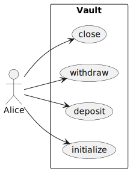
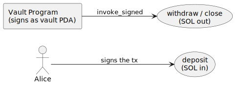
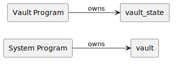

# Modeling with Diagrams

Before writing a test, model the accounts it touches: who signs, what each instruction does, and which program owns what. We draw three views of that model with [PlantUML](https://plantuml.com), and the slice of PlantUML we use is small enough to learn here in full.

Every diagram is the same skeleton with a different body:

```text
@startuml
left to right direction
skinparam shadowing false
  ...
@enduml
```

## The vocabulary

Three node shapes and two arrows, each with a fixed meaning across every diagram in this book:

| Token | Means |
| --- | --- |
| `actor Name` | a signer: a keypair that signs the transaction (a user) |
| `rectangle "Label" as X` | a program or an account |
| `usecase "Label" as X` | an instruction: an action a program exposes |
| `rectangle Name { ... }` | a boundary: a program grouped with its instructions |
| `A --> B` | a structural edge: invokes, signs, owns, or derives |
| `A ..> B` | acts on: touches an account it does not own |
| `: label` | the mechanism on the edge (`signs`, `invoke_signed`, `owns`, `seeds`) |

`\n` inside a quoted label wraps the text. That is the whole language these diagrams need.

## Use cases: who can invoke what

An `actor` outside a program `rectangle` boundary, one `usecase` per instruction, an arrow from the actor to each:

```text
actor Alice
rectangle Vault {
  usecase "initialize" as UC1
  usecase "deposit"    as UC2
  usecase "withdraw"   as UC3
  usecase "close"      as UC4
}
Alice --> UC1
Alice --> UC2
Alice --> UC3
Alice --> UC4
```



## Authority: who authorizes each movement

Signers and programs on one side, the value movements on the other, the edge label naming the mechanism. A user signs the transaction; a program signs as its PDA with `invoke_signed`:

```text
actor Alice
rectangle "Vault Program\n(signs as vault PDA)" as Prog
usecase "deposit\n(SOL in)"           as Dep
usecase "withdraw / close\n(SOL out)" as Wd
Alice --> Dep : signs the tx
Prog  --> Wd  : invoke_signed
```



## Ownership: which program owns each account

Every node is a `rectangle`, every edge is `owns`. The owner is often not the program under test: the System program owns the wallet and the vault, while the program owns only the state it allocated.

```text
rectangle "System Program" as Sys
rectangle "Vault Program"  as Prog
rectangle "vault"       as Vault
rectangle "vault_state" as State
Sys  --> Vault : owns
Prog --> State : owns
```



These three are the vault example's diagrams; [Part V](examples/vault.md) builds its test from them, and every worked example opens the same way.

To turn a `.puml` source into an image, see [Rendering PlantUML Diagrams](appendix/plantuml.md).
