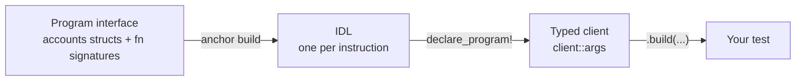
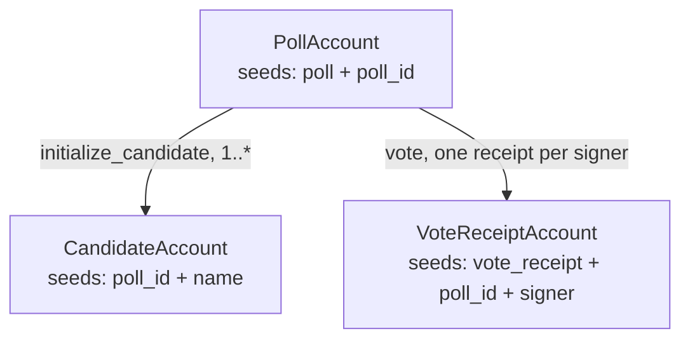

# Test-Driving a Voting Program

<details>
<summary>What we're building towards</summary>

The program grows one instruction per step; the tests grow one file per instruction.

```text
examples/voting/programs/voting/src/
├── lib.rs
├── state.rs
├── error.rs
└── instructions/
    ├── initialize_poll.rs
    ├── initialize_candidate.rs
    └── vote.rs

crates/anchor-litesvm/tests/
├── book_voting_poll.rs
├── book_voting_candidate.rs
├── book_voting_vote.rs
└── voting_interface.rs
```

</details>

The example chapters that follow test finished programs. This one builds one,
test first, and watches the tests do work beyond checking answers: they pin
down the program's interface and its exact semantics before a line of logic
gets written.

That loop is viable here because `anchor-litesvm` runs in-process with no
validator, so red to green is sub-second. Writing the test first is then a
forcing function. To call an instruction you have to name it, its accounts,
and its arguments, which settles the interface; to assert on the result you
have to say what the result should be, which settles the semantics. Both get
decided in the test, before the handler exists to have an opinion.

In this framework the forcing function has a concrete shape, and it is worth
stating the chain the chapter leans on:

1. Anchor generates the IDL from the program's *interface*: the
   `#[derive(Accounts)]` structs and the `#[program]` function signatures,
   not the handler bodies.
2. `declare_program!` generates the typed client from that IDL.
3. Your test is written against that client.



So declaring an instruction, even with an empty body, is what makes its type
appear in the client. The red-green loop gains a step plain Rust does not
have: declare the instruction, regenerate the IDL, and the client picks up
its type. The chapter watches the IDL grow one instruction at a time, then
freeze, as the codified record of the boundary you have decided on. The
drift-checked test at `crates/anchor-litesvm/tests/voting_interface.rs` reads
the committed IDLs and asserts each lists exactly the instructions declared so
far; that is the boundary pinned in place.

> [!TIP]
> **Following along.** Each snippet is tagged with the file it lives in: the
> program source under `examples/voting/programs/voting/src/`, the tests under
> `crates/anchor-litesvm/tests/`. Run a step's test with, for example,
> `cargo test -p anchor-litesvm --test book_voting_poll`. To capture every red
> and green as a real drift-checked artifact, the book builds the program in
> stages behind cargo features and splits the tests into
> `book_voting_{poll,candidate,vote}.rs`, one per instruction. To build your own
> from scratch, start with `anchor init voting` and grow a single program and a
> single test file, adding each instruction as its step introduces it.

## Step 1: what is a poll?

The fuzzy want: "create a poll." Writing the test forces the question the
handler cannot answer yet, what a poll actually consists of. The test
commits to an answer: a name, a description, a voting window, and a counter
for how many candidates have registered.

```rust
// crates/anchor-litesvm/tests/book_voting_poll.rs
let poll_account = common::voting::poll_pda(&voting_poll::ID, poll_id);

let result = ctx
    .tx(&[&alice])
    .build(
        InitializePollBundle {
            signer: alice.pubkey(),
            poll_account,
        },
        voting_poll::client::args::InitializePoll {
            poll_id,
            start: 1_000,
            end: 2_000,
            name: "Best Pet".to_string(),
            description: "Vote for the best pet".to_string(),
        },
    )
    .send_ok();

let acct: voting_poll::accounts::PollAccount =
    get_anchor_account(&ctx.svm, &poll_account).expect("poll account exists");
assert_eq!(acct.poll_name, "Best Pet");
assert_eq!(acct.poll_voting_start, 1_000);
assert_eq!(acct.poll_voting_end, 2_000);
assert_eq!(acct.poll_option_index, 0);
```

Against a program that declares no instructions, this does not compile:

```text
{{#include ../captured/voting_step1_interface_red.txt}}
```

The error is the chain read backwards. The program has no `initialize_poll`
declared, so Anchor's IDL generation emits no instruction for it; the IDL is
empty; `declare_program!` mints an empty `client::args` module; the type the
test names is not there. An empty interface has nothing to mint.

So declare it. The `#[derive(Accounts)]` struct is the interface (it, and the
function signature, are what the IDL is generated from); the body is the
logic:

```rust
// examples/voting/programs/voting/src/instructions/initialize_poll.rs
#[derive(Accounts)]
#[instruction(poll_id: u64, start: u64, end: u64, name: String, description: String)]
pub struct InitializePoll<'info> {
    #[account(mut)]
    pub signer: Signer<'info>,
    #[account(
        init,
        payer = signer,
        space = 8 + PollAccount::INIT_SPACE,
        seeds = [SEED_POLL, poll_id.to_le_bytes().as_ref()],
        bump
    )]
    pub poll_account: Account<'info, PollAccount>,
    pub system_program: Program<'info, System>,
}

impl<'info> InitializePoll<'info> {
    pub fn initialize_poll(
        &mut self,
        _poll_id: u64,
        start: u64,
        end: u64,
        name: String,
        description: String,
    ) -> Result<()> {
        self.poll_account.set_inner(PollAccount {
            poll_name: name,
            poll_description: description,
            poll_voting_start: start,
            poll_voting_end: end,
            poll_option_index: 0,
        });
        Ok(())
    }
}
```

Regenerate the IDL and its instruction set goes from `[]` to
`["initialize_poll"]`. `declare_program!` now mints `InitializePoll`, the
test compiles, and it runs green:

```text
{{#include ../captured/voting_step1_green.txt}}
```

`poll_account` is a plain bundle field rather than a derived one because its
seeds reference `poll_id`, an instruction argument the macro cannot see at
build time; the caller derives it with `poll_pda` and passes it in, the same
demotion an arg-seeded PDA takes in the escrow chapter.

## Step 2: a candidate belongs to a poll

The want: "register a candidate." The test forces two facts the interface has
to carry: a candidate is scoped to a specific poll (its PDA is seeded by the
poll id), and registering one bumps that poll's option counter.

```rust
// crates/anchor-litesvm/tests/book_voting_candidate.rs
let candidate_account = common::voting::candidate_pda(&voting_candidate::ID, poll_id, "Cat");

let result = ctx
    .tx(&[&alice])
    .build(
        InitializeCandidateBundle {
            signer: alice.pubkey(),
            poll_account,
            candidate_account,
        },
        voting_candidate::client::args::InitializeCandidate {
            poll_id,
            candidate: "Cat".to_string(),
        },
    )
    .send_ok();

let c: voting_candidate::accounts::CandidateAccount =
    get_anchor_account(&ctx.svm, &candidate_account).expect("candidate exists");
assert_eq!(c.candidate_name, "Cat");
assert_eq!(c.candidate_votes, 0);

let p: voting_candidate::accounts::PollAccount =
    get_anchor_account(&ctx.svm, &poll_account).expect("poll exists");
assert_eq!(p.poll_option_index, 1);
```

The `voting_poll` client knows only `initialize_poll`, so the new call misses
the same way:

```text
{{#include ../captured/voting_step2_interface_red.txt}}
```

Declaring the handler settles the two facts the test asked for: the
`candidate_account` PDA is seeded by `poll_id` and the candidate name, and
the body increments the poll's counter.

```rust
// examples/voting/programs/voting/src/instructions/initialize_candidate.rs
#[derive(Accounts)]
#[instruction(poll_id: u64, candidate: String)]
pub struct InitializeCandidate<'info> {
    #[account(mut)]
    pub signer: Signer<'info>,
    #[account(mut, seeds = [SEED_POLL, poll_id.to_le_bytes().as_ref()], bump)]
    pub poll_account: Account<'info, PollAccount>,
    #[account(
        init,
        payer = signer,
        space = 8 + CandidateAccount::INIT_SPACE,
        seeds = [poll_id.to_le_bytes().as_ref(), candidate.as_ref()],
        bump,
    )]
    pub candidate_account: Account<'info, CandidateAccount>,
    pub system_program: Program<'info, System>,
}

impl<'info> InitializeCandidate<'info> {
    pub fn initialize_candidate(&mut self, _poll_id: u64, candidate: String) -> Result<()> {
        self.candidate_account.candidate_name = candidate;
        self.poll_account.poll_option_index += 1;
        Ok(())
    }
}
```

The IDL grows to `["initialize_poll", "initialize_candidate"]`, the client
mints `InitializeCandidate`, and the test runs green:

```text
{{#include ../captured/voting_step2_green.txt}}
```

## Step 3: a vote counts once

The want: "let someone vote." The test forces the third instruction into the
interface and asserts the tally moves. It carries a `vote_receipt` account
whose reason to exist arrives in step 5.

```rust
// crates/anchor-litesvm/tests/book_voting_vote.rs
let bundle = vote_bundle(&alice, "Cat");
let result = ctx
    .tx(&[&alice])
    .build(
        bundle,
        voting_vote::client::args::Vote {
            poll_id: POLL_ID,
            candidate: "Cat".to_string(),
        },
    )
    .send_ok();

let c: voting_vote::accounts::CandidateAccount =
    get_anchor_account(&ctx.svm, &candidate).expect("candidate exists");
assert_eq!(c.candidate_votes, 1);
```

The `voting_candidate` client has `initialize_poll` and `initialize_candidate`,
not `vote`:

```text
{{#include ../captured/voting_step3_interface_red.txt}}
```

Declare `vote`. This first version is naive: it increments the tally and
writes the receipt, with no notion of when voting is open.

```rust
// examples/voting/programs/voting/src/instructions/vote.rs
#[derive(Accounts)]
#[instruction(poll_id: u64, candidate: String)]
pub struct Vote<'info> {
    #[account(mut)]
    pub signer: Signer<'info>,
    #[account(mut, seeds = [SEED_POLL, poll_id.to_le_bytes().as_ref()], bump)]
    pub poll_account: Account<'info, PollAccount>,
    #[account(mut, seeds = [poll_id.to_le_bytes().as_ref(), candidate.as_ref()], bump)]
    pub candidate_account: Account<'info, CandidateAccount>,
    #[account(
        init,
        payer = signer,
        space = 8 + VoteReceiptAccount::INIT_SPACE,
        seeds = [SEED_VOTE_RECEIPT, poll_id.to_le_bytes().as_ref(), signer.key().as_ref()],
        bump,
    )]
    pub vote_receipt: Account<'info, VoteReceiptAccount>,
    pub system_program: Program<'info, System>,
}

impl<'info> Vote<'info> {
    pub fn vote(&mut self, poll_id: u64, _candidate: String) -> Result<()> {
        self.candidate_account.candidate_votes += 1;
        self.vote_receipt.poll_id = poll_id;
        self.vote_receipt.voter = self.signer.key();
        self.vote_receipt.candidate = self.candidate_account.key();
        Ok(())
    }
}
```

The IDL reaches `["initialize_poll", "initialize_candidate", "vote"]` and the
happy-path vote runs green:

```text
{{#include ../captured/voting_step3_green.txt}}
```

The interface is now complete. From here the tests stop growing the IDL and
start pinning behavior, so `voting_interface.rs` asserts this instruction set
and never sees it change again.

## Step 4: when exactly is voting open?

"Voting has a window" is fuzzy in a way the earlier steps were not: the
interface already carries `start` and `end`, but nothing enforces them. The
test forces the boundary to be made exact. Open a poll whose window is
entirely in the future, leave the clock before `start`, and vote:

```rust
// crates/anchor-litesvm/tests/book_voting_vote.rs
let now = ctx.svm.get_unix_timestamp();
let start = (now + 10_000) as u64;
let end = (now + 20_000) as u64;
setup_poll(&mut ctx, &alice, start, end);

// Clock is `now`, well before `start`: this vote should not be allowed.
let result = ctx.tx(&[&alice]).build(/* Vote for "Cat" */).send_ok();
assert_eq!(c.candidate_votes, 1, "naive program let the early vote through");
```

The naive program accepts it. The transaction succeeds and the tally moves:

```text
{{#include ../captured/voting_step4_red.txt}}
```

> [!WARNING]
> The capture is an ordinary green tree, and that is the red: an out-of-window
> vote that should have been rejected went through. The naive `vote` has no
> notion of a window, so nothing stops it.

The guard codifies the window the test made the program commit to:
`start < now <= end`.

> [!NOTE]
> The exclusive start: `now <= start` is closed, not open. At exactly `start`
> the poll is still shut, and it opens one second later. That off-by-one shows
> up only because the test walks the boundary second by second; without the
> boundary case it would sit unnoticed.

```rust
// examples/voting/programs/voting/src/instructions/vote.rs (in the vote handler)
let now: i64 = Clock::get()?.unix_timestamp;
if now > (self.poll_account.poll_voting_end as i64) {
    return Err(ErrorCode::VotingEnded.into());
}
if now <= (self.poll_account.poll_voting_start as i64) {
    return Err(ErrorCode::VotingNotStarted.into());
}
```

Now the before-start vote is rejected with the program's own error:

```text
{{#include ../captured/voting_step4_green.txt}}
```

The `✗` leaf is `VotingNotStarted`, the guard firing. The IDL did not change:
a guard is behavior, and the interface Anchor reads for the IDL (the accounts
and the signature) is untouched. `voting_interface.rs` proves it: it reads
`voting_vote` and `voting_guarded` and asserts they are byte-identical. The frozen boundary
is the same one step 3 pinned; step 4 only changed what happens inside it.

## Step 5: what stops a double vote?

The forcing question: "what stops Mallory voting twice?" The test is written
expecting to add a guard for it. Mallory votes once (fine), then tries again
for a different candidate:

```rust
// crates/anchor-litesvm/tests/book_voting_vote.rs
// Mallory votes once: fine.
ctx.tx(&[&mallory]).build(/* Vote for "Cat" */).send_ok();

// Mallory votes again, for a different candidate. Expect this to be rejected.
let ix = ctx.program().build_ix(
    vote_bundle(&mallory, "Dog"),
    voting_vote::client::args::Vote { poll_id: POLL_ID, candidate: "Dog".to_string() },
);
let result = ctx.send_err(ix, &[&mallory]);
```

It passes with no new code. The receipt account was there since step 3,
seeded by `[SEED_VOTE_RECEIPT, poll_id, signer]`: the poll and the voter, and
nothing about the candidate. A second vote from the same signer resolves to
the same receipt PDA, and its `init` collides with the account already sitting
there. The invariant was codified in the account model before anyone thought
to write a guard for it.

```text
{{#include ../captured/voting_step5_green.txt}}
```

The `✗` is not the program's own logic. The failing leaf is `System [2]`, and
the error is `InstructionError(0, Custom(0))`: the System program's
`AccountAlreadyInUse`, raised when `init` asks it to create an account that
already exists.

> [!TIP]
> TDD surfaced a structural invariant. The double-vote test was written
> expecting to drive a new guard. It passed untouched: the receipt PDA, seeded
> by poll and signer, already made a second `init` collide. Sometimes the
> test's job is not to drive new code but to prove the account model already
> carries the rule.

## Where this leaves us

Five steps in, the program equals the capstone it was modeled on, and the IDL
is the record of every boundary decision made along the way: three
instructions, declared in the order the tests demanded them, then frozen. The
three accounts and the seeds that key them, with the receipt keyed by voter
rather than candidate (the one-vote-per-poll rule from step 5):



The full sources are in `crates/anchor-litesvm/tests/`:

- `book_voting_poll.rs`, `book_voting_candidate.rs`, `book_voting_vote.rs`:
  the tests, one file per instruction (`book_voting_vote.rs` drives steps 3 through 5).
- `voting_interface.rs`: the drift-checked boundary, asserting the IDL grows
  then freezes.

For testing finished programs, the way most tests start, the Vault and Escrow
chapters are the place to go next.
