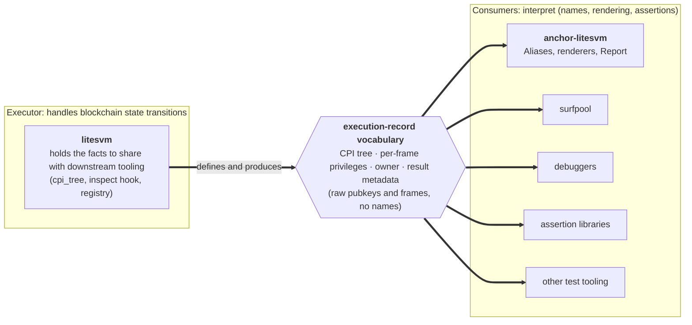

# litesvm and anchor-litesvm: where services belong

## Scope

This doc draws the boundary between **litesvm** (the executor) and the testing
layers above it (`litesvm-utils`, `anchor-litesvm`), and states the principle
that decides which side a given service lives on. It describes the *current*
shape in this repo: what each layer owns today, and what is reconstructed above
litesvm as a stopgap.

The forward direction (an executor-owned, configurable observer registry that
would dissolve the stopgaps) is sketched at the end as a direction, not a landed
design; this doc focuses on the boundary as it stands today.

Out of scope: the renderers themselves ([`cpi-rendering.md`](cpi-rendering.md))
and the derive macros ([`bundled-pubkeys.md`](bundled-pubkeys.md)).

## The principle

A type or service representing an execution fact belongs to the layer with
first-hand knowledge of the fact and the means to produce it. litesvm runs the
transaction, so it alone witnesses the per-frame facts: an `invoke_signed` PDA
shows as a signer one frame down, where the transaction message header cannot
see it. So litesvm is the natural definer of the *vocabulary* of the execution
record; the layers above should name and render that vocabulary, not re-derive
it. Defining a fact-type anywhere else forces a re-derivation from a weaker
source, and that re-derivation is exactly the stopgap we carry today.

This is not theoretical. litesvm already owns part of this vocabulary: the CPI
tree (`litesvm::cpi_tree`) lives there because the logs are the executor's
artifact. The trace facts (per-frame privileges) are the same kind of artifact,
one frame deeper; the argument for where they belong is the same argument.

## Definitions

- **Executor**: litesvm. Runs the transaction; sees every frame as it executes.
- **Consumer**: `litesvm-utils` / `anchor-litesvm`. Builds tooling on top of
  what the executor produces.
- **Execution record**: the per-transaction account of what happened when it
  ran: the CPI tree, per-frame account privileges (`is_signer` / `is_writable` /
  `owner` *as presented to that frame*), and the result (logs, compute, error).
  The substrate every "nice test output" tool needs first.

## The boundary, at a glance

The principle splits responsibility cleanly: the **executor observes and
hydrates** the execution-record vocabulary (raw pubkeys and frames), and
**consumers interpret** it (names, rendering, assertions). litesvm is the natural
home because it handles the blockchain state transitions, so it holds the facts
downstream tooling needs first-hand; everything downstream (anchor-litesvm,
surfpool, debuggers, assertion libraries) interprets the vocabulary rather than
re-deriving it.

That is the argument for upstreaming these features into litesvm: a fact captured
once in the executor serves every consumer at once, where the same fact
reconstructed in each consumer (the stopgaps this repo carries today) serves only
that one. The seam is the vocabulary in the middle, not any one crate.

That is the target the principle implies. The next section maps the *current*
reality onto it: part of the vocabulary already lives in litesvm (`cpi_tree`),
and part is still reconstructed above it as a stopgap.

## The current boundary

litesvm here is the `cds-rs/litesvm` fork
(`git = "https://github.com/cds-rs/litesvm"`), which carries two features this
project leans on: the `cpi_tree` module and the `invocation-inspect-callback`
hook. The ledger below is where each service sits *today*.

| Service | Lives now | Why / the ask |
|---|---|---|
| CPI tree structure (log parse into a frame forest) | **litesvm** (`cpi_tree`) | Settled. The precedent for everything else here: the logs are the executor's artifact, so the parse belongs with it. (An in-repo copy was deleted once this upstreamed; see `cpi-rendering.md`.) |
| In-flight per-frame inspect hook | **litesvm** (`invocation-inspect-callback`: `InvocationInspectCallback::after_invocation`) | The executor is the only layer present during execution, so the hook can only live there. |
| Per-frame privileges (`is_signer` / `is_writable` / `owner` as presented to each frame) | **consumer** rides the hook (`TraceRecorder`) and overwrites a message-derived reconstruction (`model::fill_from_trace`) | Reconstruction from the transaction `Message` only knows *top-level* privileges; the trace is what makes inner frames correct. The ask: carry the account list + privileges on `CpiFrame`, and the reconstruction deletes itself. |
| Final account owner (for the ownership graph) | **consumer** post-execution lookup (`model::fill_owners`, needs `&svm`) | This is why `print_ownership_graph` takes `&svm` and no other render method does. The ask: carry the owner on the frame. |
| Pairing the trace with its result | **consumer** (`AnchorContext::finish_send` drains the `TraceHandle` onto each result via `with_instruction_trace`) | The pairing can only happen where the frames, the result, and the logs are all held at once. The executor holds them natively; the consumer has to own the send to reconstruct that boundary. This is the "doors" cost (see below). |
| Naming, aliasing, rendering, assertions | **consumer** (`Aliases`, the renderers, `Report`) | Stays here by design: interpretation is not a fact about execution. The executor speaks raw pubkeys and frames; names are applied at render time. |

## How it's wired now

`AnchorContext` holds a raw `LiteSVM`. At construction it installs a
`TraceRecorder` on the inspect hook (`TraceRecorder::install(&mut svm)`, returning
a `TraceHandle`). Every tracked send (`send_ok` / `send_err` / `send_err_named` /
`send_instructions`) routes through `finish_send`, which drains the latest trace
onto the result (`with_instruction_trace(self.trace.take_latest())`). The model
then unifies three inputs: the log-derived tree structure (`cpi_tree`), the
trace-derived per-frame privileges (`fill_from_trace`), and post-execution owners
(`fill_owners`). The renderers read the unified model.

The coupling the forward direction targets is visible right here: the record is
captured only for sends that pass through a consumer wrapper, so each new send
shape needs a new wrapper to re-pair the trace with the result. That coupling is
the thing the registry direction is designed to remove.

## The adapter, and where this is heading

`ObservedSvm` (`litesvm-utils/src/observe.rs`) is the prototype of the
executor-owned observer registry: an adapter over `LiteSVM` that holds a
configurable set of observers, runs them on every send, and produces a typed
metadata bag the caller reads off the result. It is built **adapter-first** on
purpose: the vocabulary is discovered by dogfooding before it is promoted to the
fork. Its types are deliberately shaped *as litesvm types* (raw pubkeys and
frames, no `Aliases`, no anchor coupling), so they can relocate into litesvm
unchanged.

It is a prototype, not yet the load-bearing path: `AnchorContext.svm` is still a
raw `LiteSVM` with the `TraceRecorder` riding the hook, not an `ObservedSvm`.
Routing the context through the adapter, and then promoting the registry into the
fork, is the migration this points toward. The success criterion is **deletion**:
when the registry lives at the executor, the tracked-send doors and `finish_send`
go away and the consumer just reads typed metadata off the result it already gets
back.

## References

- The renderers that read this boundary's output: [`cpi-rendering.md`](cpi-rendering.md).
- Code: `crates/litesvm-utils/src/transaction/trace.rs` (the recorder over the
  hook), `model.rs` (`fill_from_trace`, `fill_owners`), `observe.rs` (the
  adapter prototype); `crates/anchor-litesvm/src/context.rs` (`finish_send`).
- The litesvm fork: `https://github.com/cds-rs/litesvm` (`cpi_tree`,
  `invocation-inspect-callback`).
