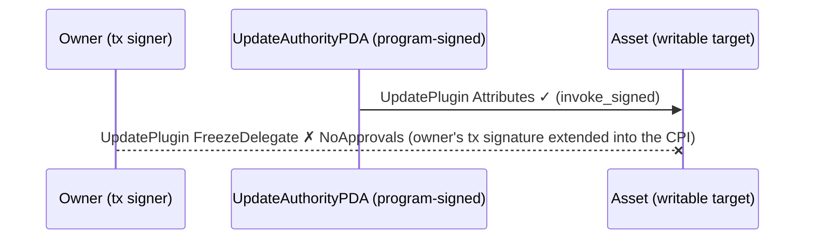
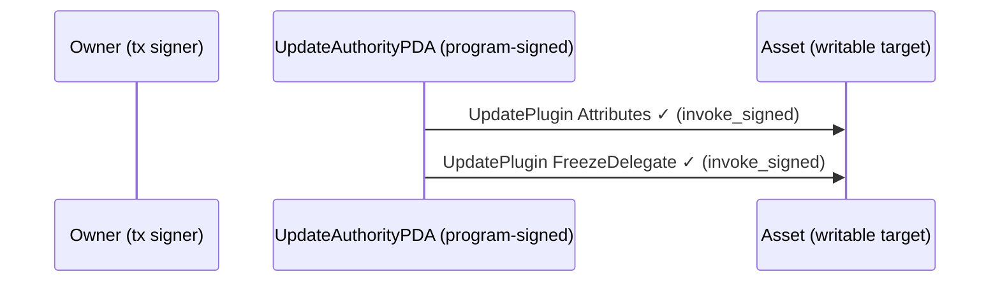

# Authority-flow rendering: generate "who may cause what" from execution

The structured tree and the mermaid renderer show *control* flow: which
program called which, what returned, where it failed. This proposal is about
the view they cannot show today: *authority* flow. Which human keys signed,
which PDAs the program signed as (`invoke_signed`), and which accounts those
combined privileges actually changed.

The thesis, stated once because everything else follows from it: Solana's
execution model is accounts-first. Programs are stateless; every effect is a
write to an account; and every write is gated by a privilege check (a signer
or an owner). "Who may cause what" is not documentation *about* the system,
it **is** the system's security model. A test harness for a system where
accounts are everything should be able to surface the account-privilege view,
not just the call view.

## Where this came from

The nft-staking dogfood hand-authored an authority-flow diagram
(`authority-flow.puml` in that repo): per instruction, which human signs,
which PDA the program signs as, and which account changes. It is the visual
twin of the "signer asymmetry" table in that project's design doc, and both
of that program's historical bugs were violations of exactly the
relationships it draws.

The natural question followed: the framework already generates sequence
diagrams from execution; can it generate this? The answer splits cleanly into
"almost" and "one missing bit", and the missing bit is interesting enough to
deserve this document.

## What is generatable today

Per transaction, the framework already has:

| Ingredient | Source |
|---|---|
| Human signers (the left column) | the transaction message's signer flags (`SignerInfo`, already threaded into the mermaid renderer) |
| The call structure | the CPI tree (logs / `cpi_tree`) |
| Names for the PDAs | the alias table; tests register "UpdateAuthorityPDA", "Config", ... via `alias_all` |
| The touched accounts (the right column) | the message's writable-account set |

That is the left column, the right column, and the arrows' endpoints.

## The granularity gap (the one missing bit)

The middle column, "the program signed this CPI **as** PDA X", is not
recoverable from anything litesvm currently exposes.

Why: when `invoke_signed` runs, the CPI's account metas mark the PDA as a
signer; that is literally the input to the runtime's privilege check (claim a
signer the runtime can't justify and you get `PrivilegeEscalation`; the
nft-staking stake bug was exactly this). But Solana *records* inner
instructions as `CompiledInstruction`s: a program index, account *indices*,
and data. The per-CPI `is_signer` / `is_writable` flags are dropped at
compilation. The logs don't carry them either.

And there is no sound heuristic around the gap. "A known PDA appears in a
CPI's account list" does not distinguish PDA-as-signer from PDA-as-data, and
real programs do both (nft-staking's config PDA signs `mint_to` CPIs and rides
unsigned through others).

## The contrast that makes the case

Both traces below are real captures from the nft-staking restake work
(2026-06-01): the first is the *draft* fix for the restake bug (FreezeDelegate
update signed by the owner), the second is the *landed* fix (the same update
signed by the update-authority PDA via `invoke_signed`). Same test, same
transaction signers, same programs, same instruction names, same shape:

```
The draft fix (rejected):                      The landed fix (accepted):

── staking::Stake ─────────────────────        ── staking::Stake ─────────────────────
Transaction  signers=[Owner]                   Transaction  signers=[Owner]
└── staking::Stake [1] ✗ 59840cu               └── staking::Stake [1] ✓ 61225cu
    ├── MplCore::UpdatePlugin [2] ✓                ├── MplCore::UpdatePlugin [2] ✓
    │   └── System::Transfer [3] ✓                 │   └── System::Transfer [3] ✓
    ├── MplCore::UpdatePlugin [2] ✗                └── MplCore::UpdatePlugin [2] ✓
    │   └── Error: 0x1a (NoApprovals)
    └── Error: 0x1a
```

The only difference between these two transactions is who the program
presented as the signer of the second `UpdatePlugin`: the owner (rejected) or
the PDA (accepted). That fact is the entire bug, the entire fix, and it
appears in **neither trace**. The CPI view can show you that something was
refused; it structurally cannot show you *what was different about the request
that succeeded*. The authority view is precisely that difference, and the data
to draw it is the data the privilege check already consumed.

(Bug 1 in the same saga, the unconditional `AddPlugin` colliding with a
leftover plugin, *is* legible from the CPI view: `AddPlugin` vs `UpdatePlugin`
is a shape difference. That is the boundary worth naming: control-flow bugs
show up in the control-flow view; authority bugs do not.)

### The same two transactions, in the proposed authority view

What the renderer (next section) would emit for each, mocked here as
spec-by-example. Three lanes: the transaction's human signers, the PDAs the
program signed as, and the writable targets. An arrow's *origin lane* is the
authority that carried the write.

The draft fix (rejected):



The landed fix (accepted):



In the CPI view these transactions are the same picture; in the authority
view, the bug is the most prominent feature of the picture: the second write
comes out of the wrong lane. One arrow's origin is the difference between a
program where only the protocol can thaw and re-freeze stakes, and one where
any owner-signed transaction could try. That is what "this view is the
security model" means in practice, and it is one diagram's worth of evidence
for the litesvm ask below.

## Where the missing bit lives: the litesvm ask

Inside the SVM, the `TransactionContext` instruction trace holds, for every
frame at every depth, `InstructionAccount { is_signer, is_writable, .. }`.
The runtime computes this because it must (privilege enforcement); agave then
compiles it down to `CompiledInstruction`s when recording inner instructions,
and the flags die at that step.

So the upstream ask, scoped as its own deliverable because it is a litesvm PR
rather than a litesvm-utils feature:

> **litesvm: expose the uncompiled instruction trace.** Per executed
> transaction, a parallel structure to `inner_instructions` that preserves
> per-frame account metas with privilege flags. Roughly:
>
> ```rust
> pub struct TracedInstruction {
>     pub program_id: Pubkey,
>     pub stack_height: u32,
>     pub accounts: Vec<TracedAccount>,   // pubkey + is_signer + is_writable
>     pub data: Vec<u8>,
> }
> // TransactionMetadata gains: pub instruction_trace: Vec<TracedInstruction>
> ```
>
> Two viable extraction shapes, to be settled in the PR itself: (a) export a
> parallel uncompiled trace from the `TransactionContext` before agave's
> inner-instruction compilation discards it, or (b) extend the recording to
> retain the flags. Either way the data already exists at the extraction
> point; this is surfacing, not computing.

Worth saying out loud in the PR's motivation: **no other environment can
offer this view.** Mainnet RPC returns compiled inner instructions, so
explorers cannot show authority flow either. An in-process SVM is uniquely
positioned to surface it, which makes it exactly the kind of feature that
justifies testing against litesvm rather than a validator.

Status: parked until after the cohort discussion of the hand-authored
diagram; the PR motivation is strongest with that artifact (and the two bugs
it explains) in hand.

## The renderer (litesvm-utils, once the data exists)

The detection rule is one line: an account that is a **signer in a CPI frame**
but **not a transaction-level signer** was signed for by the calling program
(`invoke_signed`). Everything else is presentation, and the granularity is
the maintainer's stated requirement, near-verbatim: *"each call to svm
(submit) would generate this; and we'd group it by test."*

- **The unit of generation is one submit.** Every `send_ok` / `send_err` /
  `send_err_named` produces one authority *section*: the transaction's human
  signers (by alias), each `invoke_signed` PDA as the lane the effect routes
  through, and the writable accounts of those frames as the targets. The same
  way a submit can already produce a CPI tree.
- **The unit of grouping is the test.** Sections accumulate in submission
  order and emit as one diagram per test: the test's authority story. The
  collector for "accumulates as the test runs, emits per test" already
  exists; it is the `Report`. A test that threads a `Report` gets its
  authority diagram alongside the narrative, with `step()` headings labelling
  the sections, written on `Drop` next to (or inside) the per-test Markdown.
- **The reference rendering exists.** nft-staking's
  `restake-authority-flow.puml` is a hand-authored picture of exactly what
  the generated diagram for that one test should look like: one section per
  submitted transaction (stake, unstake, stake again), arrows = signatures,
  PDA lanes in the middle. (Its `alt` block showing the two historical bugs
  is design commentary; a generated diagram shows only what this run did.)
- **Per suite (derived, secondary)**: from the per-test sections, aggregate
  per instruction name and dedupe into one **observed authority map**.
  Deterministic identities make both artifacts byte-stable, so they are
  committable and diffable, exactly like TESTRUN.md. A program change that
  alters who signs what shows up as a diff.

The pairing that falls out is the same one `Report` / `print_markdown_pair`
established: the hand-authored diagrams (nft-staking's
`authority-flow.puml` for the whole program, `restake-authority-flow.puml`
for the one scenario) are the *design* statements; the generated diagrams are
the *observation*; divergence between them is a finding, surfaced by a diff
rather than by someone noticing.

## What stays authorial

Two things the trace cannot know:

1. **ESTABLISHES vs exercises.** The runtime sees a CPI; it does not know
   that this particular CPI is the moment the program acquires control of the
   collection. Partially recoverable with the
   [account state diff](account-state-diff.md) layer (a write that *changes
   an authority field* is an establish event), but the semantic labeling
   stays a design judgment.
2. **Intent prose.** Why the authority is shaped this way belongs to the
   author, same as `Report`'s intent channel.

## Convergence: three proposals, one upstream need

This is the third proposal whose ceiling is "litesvm doesn't expose enough of
what it already computes":

| Proposal | Needs from execution |
|---|---|
| [account-state-diff](account-state-diff.md) | account snapshots around a transaction |
| **authority-flow (this)** | per-CPI account metas with privilege flags |
| [trace-color-semantics](trace-color-semantics.md) | consumes both: green = mutation (state diff), signed-as lanes (this), red = failure origin (already have) |

If the litesvm PR happens, it should be designed once for all three: the
instruction trace with privilege flags plus pre/post account state covers
every row of that table. That is one coherent ask ("expose the execution
record you already have") rather than three small ones.

## Sequencing

1. Cohort discussion of the hand-authored diagram (in flight).
2. The litesvm PR (the ask above), motivated by that artifact and the
   convergence table.
3. The litesvm-utils renderer + the observed-authority-map aggregation.
4. nft-staking adopts it: the generated map lands next to TESTRUN.md, and
   `architecture.md`'s diagram becomes the design statement it is checked
   against.
